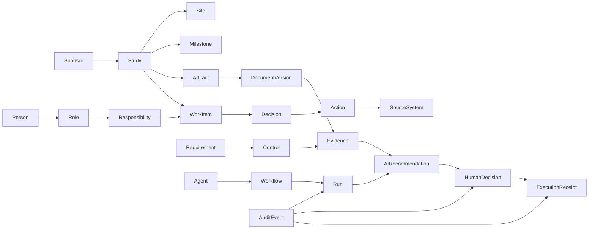
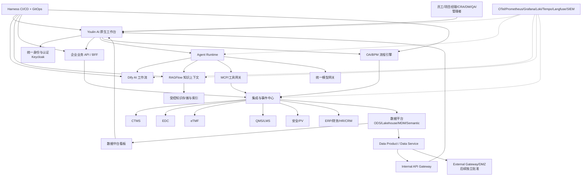
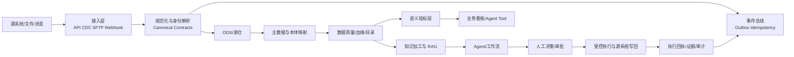
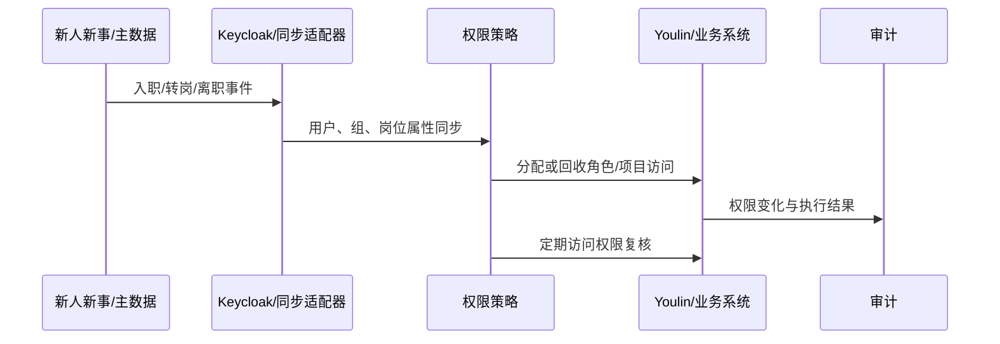
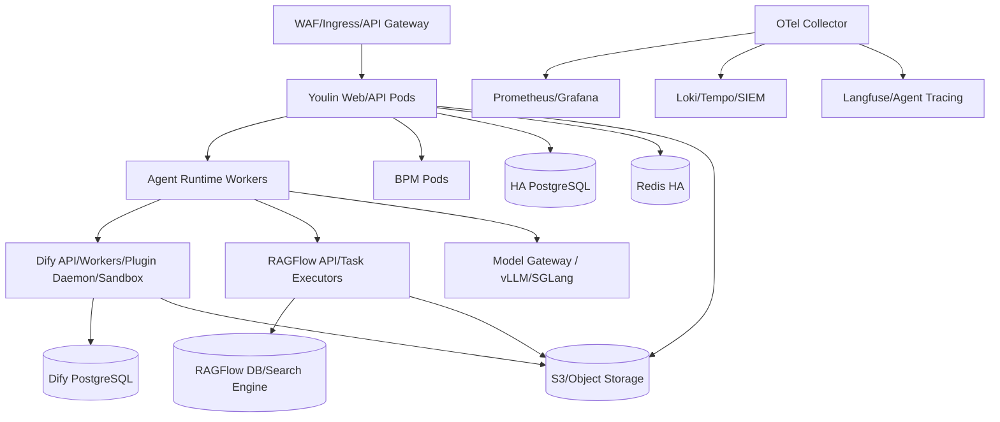
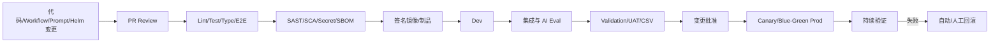

# CRO AI 原生工作台：项目分析、目标架构与二开路线

> 状态：第一版战略分析  
> 日期：2026-08-06  
> 基线：当前仓库 `feat/youlin-enterprise-ai-platform`，提交 `ca27228d55`  
> 说明：本文将需求中的“企业本地论”按“企业本体论（Enterprise Ontology）+ 企业本地化部署方法论”理解；若原意不同，应在下一轮澄清。

## 0. 执行摘要

这个项目适合成为 CRO 企业 AI 工作台的交互与智能体运行底座，但不适合在未经补强的情况下直接承担完整企业中台、OA 审批、GxP 受控记录和多租户权限中心。

建议的产品定位是：

> Youlin 不是一个“聊天机器人集合”，而是 CRO 员工处理任务、判断风险、调用企业知识、协同智能体、完成审批并沉淀证据的统一工作台。

核心架构分工：


| 层级               | 推荐职责                                  | 不应承担                          |
| ---------------- | ------------------------------------- | ----------------------------- |
| LobeHub / Youlin | 统一工作台、对话与任务入口、智能体协作、决策收件箱、证据展示        | 企业主数据唯一来源、复杂业务流程管理引擎、监管电子签名底座 |
| Dify             | 可视化 AI 工作流、Prompt/模型节点编排、快速试验、API 化发布 | OA 权威审批状态、跨系统长事务、企业身份主数据      |
| RAGFlow          | 复杂文档解析、知识加工、检索、引用、受控知识服务              | 员工门户、OA、通用业务编排                |
| BPM/审批引擎         | 流程定义、版本、会签、转办、SLA、电子签名、审批审计           | 大模型推理和知识检索                    |
| Harness          | CI/CD、GitOps、环境发布、制品、策略、回滚、交付审计       | CRO 业务审批、AI 业务工作流             |
| 企业数据平台           | 数据接入、主数据、湖仓、指标、血缘、质量和数据服务             | 直接替代源业务系统                     |


最重要的三个结论：

1. **项目不存在开源商业许可阻塞。** 当前重点是身份、权限、数据、安全、集成和可运维性，不再重复进行许可可行性论证。
2. **代码里存在工作区和基于角色的访问控制（RBAC）数据结构，不等于开源版已经具备完整企业工作区。** 当前仓库的 RBAC 中间件明确是开源版空实现，工作区路由也包含仅云版实现或尚未实现的占位代码。企业权限、工作区生命周期和审计需要自行实现或采购官方商业能力。
3. **AI 审批和 OA 审批是两个概念。** LobeHub 已有工具调用前的人机确认、任务、简报、验收等良好基础；但企业 OA 需要独立的流程定义、候选人计算、会签/或签、转办、加签、超时、签名与不可抵赖审计。AI 可以起草、核验和建议，不能成为受监管流程的终态责任人。

推荐采用“平台 MVP + 通用灯塔场景”的两步策略。

MVP 1 先完成：

- 企业 SSO、企业微信登录、唯一账号与组织同步；
- Web、Desktop/Electron 和企业私有部署；
- Workspace、RBAC、资源权限、审计与配额；
- 企业 Skill、Tool、Workflow、Agent 的注册、审核、发布与回滚；
- 个人、团队、企业和项目级资源库，提供上传、分享、预览、下载、版本和回收站；
- 资源原件、版本、预览衍生物、个人记忆载荷和 AI/Workflow 产出物统一进入企业 OSS；
- 企业/团队/项目/个人知识库和资源发布为知识的治理链路；
- 个人通用记忆、个人项目记忆、项目共享记忆和项目上下文分层治理，AI 产出物按来源和受众继承权限；
- Project 作为经营与矩阵权限单元，Context Assembler 为每次 Agent 运行生成授权的 Runtime Context Package；
- 统一首页、导航、权限感知全局搜索、任务、通知、评审、反馈、Feature Flag 和运营支持闭环；
- “有临员工工作助手”，基于员工工作指引、规章制度和非 GxP SOP/WI 提供受控引用并验证完整链路；
- 湖仓与 API 控制面的最小骨架，以一个低敏数据源、一个 Data Product 和一个内部只读 API 验证目录、质量、血缘、授权和审计。

MVP 稳定后按 24～36 个月产品路线逐步进入企业采用、PM/项目经营、智能报销/报价、Clinical Copilot、GxP 受控集成和外部产品生态。外部生产 API、完整企业图谱和受控场景必须独立 Go/No-Go。完整能力域和投资门见[完整产品能力与演进蓝图](./12-full-product-capability-and-evolution-blueprint.md)。

---


## 1. 本次分析的证据范围与置信度


### 1.1 已检查的代码与外部平台证据

- 项目架构与开发约定：`docs/development/basic/architecture.mdx`、项目 `AGENTS.md`；
- 自托管与依赖：`docker-compose/deploy/docker-compose.yml`、`docs/self-hosting/**`、`.env.example`；
- 身份认证：`src/auth.ts`、`packages/env/src/auth.ts`、Generic OIDC 文档；
- 工作区与 RBAC：`packages/database/src/schemas/workspace.ts`、`rbac.ts`、`packages/const/src/rbac.ts`、`packages/business-server/**`；
- Agent、任务、知识、检索、评测与可观测相关源码和文档；
- Dify、RAGFlow、Harness 官方文档、官方仓库和部署资料。

仓库不存在 `.codegraph/`，因此按项目指引没有自行建索引，改用文档和源码定位。

### 1.2 已获得的企业事实与材料

以下内容已由企业提供，可作为当前规划输入：

- 组织材料：`know/有临组织架构-人员职责版_副本.png`。该图确认企业存在董事会/CEO、职能部门、临床业务专业线和大量专业岗位，组织与项目协作具有矩阵特征；法人、事业部、部门和项目组关系仍需转为结构化清单后核验。
- 现有系统：HR 为新人新事；OA 为泛微，并计划在泛微内重塑流程体系；CRM 为自研系统；CTMS、EDC、IWRS、eTMF 为医渡科技的有临定制产品；财务系统为用友。QMS、LMS、PV/安全数据库等系统也纳入现状盘点。
- 身份架构：已选定私有部署 Keycloak 作为企业统一 IdP/Identity Broker，Youlin 通过 Generic OIDC 接入，企业微信通过独立 Adapter/SPI 接入 Keycloak。
- 数据可得性：上述系统理论上均可取得数据，因此当前不把“完全无法获取数据”作为默认假设；实际接入仍需核验版本、接口/导出方式、部署位置、数据责任人、频率、SLA 和合同约束。
- 业务样本：`know/有临CRO报价工具_v4.22_20260821.xlsx` 提供了真实报价工作载体，覆盖项目参数、业务范围、服务费/其他费用、角色与标准工时、折扣、签批、项目时间计划、Rebid 和合同变更等任务。它可支持报价流程建模，但不能单独证明实际处理时长、等待时间、返工率、差错率或稽查发现。
- 知识样本：`know/有临医药员工工作指引手册_V1_2605.docx` 覆盖入职、岗位任务、HR、财务、行政、品牌、IT、法务和内部协作，可作为首期员工工作助手的导航知识；其中引用的正式制度、SOP/WI、OA 通知和系统指引仍需收集有效版本并由内容 Owner 审核。
- 合规范围：MVP 1 不处理 GxP/Part 11 受控电子记录；后续阶段再评估 CTMS、EDC、eTMF、ePRO、IWRS 及相关流程。
- 数据边界：当前基线为所有企业数据不出境、不越出批准的数据处理边界；跨境协作、人遗和受试者数据均不进入 MVP 1。
- 规模与模型：公司规模约 300～500 人；已有企业模型网关，可接 OpenAI 与阿里云百炼。任何外部模型路由都必须继续满足“不出境/不越界”基线。

### 1.3 仍需核验的事实

- 法人、事业部、部门、汇报线、岗位和项目组的结构化映射及权威来源；
- 各业务系统的准确版本、接口、部署位置、数据责任人、数据质量、SLA 和合同限制；
- 报价及其他真实任务的当前工时、等待、返工、差错、稽查发现和月度业务量；
- 峰值并发、文档数量与增量、模型调用量、本地 GPU 需求和已批准预算；
- 企业模型网关到 OpenAI/阿里云百炼的部署区域、字段脱敏、日志留存和路由策略。

因此，本文对企业组织、系统版图、首期合规边界、规模和模型入口的描述已不再是纯行业推断；但用户任务心智、量化业务基线及详细接口设计仍需通过访谈、跟岗、系统核验和样本测量确认。

---


## 2. 当前项目能力盘点


### 2.1 可以作为企业底座复用的能力


#### 统一 AI 工作空间

- Web SPA、桌面端和多端路由基础；
- 对话、话题、页面、文档、文件和知识库；
- 智能体构建器、智能体组、多智能体监督者/执行者协作；
- 任务、子任务、依赖、执行 Topic、定时和心跳运行；
- 简报已建模为 `decision / result / insight / error`，非常适合发展为企业决策收件箱；
- 个人记忆、智能体文档和工作成果登记。


#### 智能体运行与工具生态

- 模型适配层与多供应商支持；
- Plan-Execute 循环、工具单次/批量执行；
- 工具调用级“人在回路”确认；
- MCP、连接器、内置工具、代码/沙盒能力；
- 上下文压缩、Token/费用计量；
- 智能体信号、运行钩子、异构智能体接入；
- IM/机器人通道基础。


#### 知识与 RAG 基础

- 文件上传和 S3 对象存储；
- 文档、Chunk、Embedding、知识库及其关联模型；
- PostgreSQL pgvector/全文检索基础；
- 可选 Unstructured 文档解析；
- 知识库搜索/读取内置工具；
- RAG 评估数据集、评价和记录模型。


#### 身份、安全和治理基础

- Better Auth 邮箱密码与多种 OAuth/OIDC；
- Generic OIDC 可直接对接已选定的 Keycloak；
- API Key、凭据加密和工具干预基础；
- 工作区、成员、邀请、审计日志、RBAC 表结构及权限常量；
- 资源所有权、公开/私有可见性字段；
- 智能体/大语言模型调用链追踪、OTel、Langfuse、Grafana 文档基础；
- 智能体评测、验证、证据、验收等质量模型。


#### 自托管基础

官方 Compose 的基础栈包含：

- LobeHub；
- PostgreSQL/ParadeDB（pgvector + pg_search）；
- Redis；
- RustFS（S3 兼容）；
- SearXNG。

它适合开发、POC 和小规模部署，但不等于生产级高可用方案。

### 2.2 “看起来有、实际上要补”的能力


| 能力        | 代码现状                                      | 企业化判断                                  |
| --------- | ----------------------------------------- | -------------------------------------- |
| 工作区       | 有数据结构、索引和部分界面/类型                          | 真实服务实现存在云版覆盖关系；开源版工作区能力需逐项验证           |
| 基于角色的访问控制 | 有细粒度权限常量和表                                | 开源版 `withRbacPermission` 是空实现，不能作为安全边界 |
| 审计日志      | 有工作区审计数据结构和路由形状                           | 必须验证开源版写入链、查询、保留、防篡改是否完整               |
| 任务审批      | 有任务、简报、人工工具确认、验收                          | 不是通用 OA/业务流程管理，也不是法规电子签名系统             |
| 长任务       | 有 QStash/Upstash 工作流相关路径                  | 完全本地化需解决 QStash 依赖或替换队列/工作流实现          |
| Sandbox   | 有 provider 抽象                             | 默认市场服务与私有 Onlyboxes 的可用性、隔离强度需验证       |
| 多租户       | 多表包含 workspaceId                          | 仅有字段不代表所有读写路径均强制租户隔离                   |
| 云版能力      | `src/business`、`packages/business` 有 stub | 开源仓库与官方云版是两个能力面，不能引用云版宣传当作 OSS 验收依据    |


### 2.3 明确需要新增的企业领域能力

- 企业组织、岗位、汇报线、项目角色与矩阵组织；
- 新人新事 API、身份同步适配器与 Keycloak Admin API 驱动的入转调离、组同步和权限回收；
- 通用 OA/BPM、表单、流程版本、代理/转办/加签/会签、SLA、催办；
- 合规电子签名、签名含义、再认证和签名绑定；
- 不可篡改审计、记录保留、Legal Hold、归档和监管导出；
- CRO 领域本体、受控词表、业务规则和主数据；
- CTMS/EDC/eTMF/QMS/PV/ERP/HR 等系统集成；
- 数据目录、血缘、数据质量、指标语义层和行列权限；
- 模型/提示词/知识/智能体/工作流的版本与发布审批；
- AI 风险分级、评测门禁、内容安全、隐私与成本治理；
- 生产级多环境、高可用、备份恢复、灾备、容量和 SRE。

---


## 3. 已确认前提

所有纳入方案的开源项目均已完成商业使用授权，本项目直接进入工程和产品实施。后续只治理组件来源、版本、漏洞、镜像签名和升级维护。

---


## 4. 产品定义：CRO AI 原生工作台究竟是什么


### 4.1 不是“大一统后台”

工作台不应该复制 CTMS、EDC、eTMF、QMS、ERP 的全部界面。源系统继续作为权威记录系统。Youlin 解决的是跨系统工作：

1. 我今天必须处理什么；
2. 当前判断需要哪些事实和证据；
3. AI 已经做了什么、依据是什么、可信度如何；
4. 我批准后会触发什么业务事件；
5. 结果写回哪里、由谁负责、是否可追溯。


### 4.2 用户视图而不是技术组件视图

顶层信息架构建议使用用户任务，而不是 `Dify / RAGFlow / MCP / 工作流运行记录`：

- **首页与全局搜索**：最近内容、常用 Agent、我的项目、应用、系统状态和权限感知搜索；
- **我的工作**：任务、通知、待决策、待复核、待处理、关注和异常；
- **研究项目**：按 Study/Program 查看里程碑、风险、站点、文档和行动；
- **资源与知识**：个人/团队/企业/项目资源库、文件分享预览、受控知识、引用、版本和适用范围；
- **记忆与产出物**：个人通用/项目私有记忆、项目共享记忆、Agent/Workflow 产出物、来源和权限继承；
- **项目上下文**：项目经营事实、资源、决定、风险、指标和共享记忆形成的角色化视图；
- **智能体团队**：可调用的业务智能体、技能和权限；
- **数据洞察**：有明确管理目的的指标与钻取；
- **流程中心**：发起、处理、追踪业务流程；
- **应用与集成**：企业应用、连接器、模块和开发者入口；
- **管理与治理**：组织、权限、评审、Feature Flag、AI、知识、数据、审计、反馈和运营。

Dify、RAGFlow 和 Harness 应隐藏在管理/工程界面或作为深链入口，不应成为普通 CRO 用户的一级菜单。

### 4.3 首页应是决策台，不是领导驾驶舱

首页首先回答“什么事情正在等我”，按所需行动分组：

- 需要我决策：展开原因、证据、推荐动作；
- 需要我复核：展示变更点、异常和未覆盖证据；
- 需要我处理：展示期限、责任和下一步；
- 仅需知晓：一行摘要；
- 系统异常：按业务影响排序，而不是按技术错误级别排序。

管理看板是用户主动访问的分析空间，不应挤占每个人的首页。

### 4.4 AI 原生的五个产品原则

1. **对象中心**：对话必须挂在研究、中心、文档、问题、流程等业务对象上，而不是成为孤岛。
2. **证据先行**：回答、建议和自动化动作均带来源、版本、适用范围和置信度。
3. **人在终态**：高风险业务由具备权限的人完成最终批准、签署、释放或提交。
4. **从协助到代理渐进升级**：观察 → 起草 → 建议 → 经批准后执行 → 有限自治。
5. **学习可治理**：用户可纠正 AI 记忆和反馈；训练、评测、知识更新和 Prompt 发布均可追溯。

---


## 5. CRO 企业本体论：统一业务语义的骨架


### 5.1 为什么先做本体，不先做大屏

如果 CTMS 的 `study`、eTMF 的 `trial`、财务的 `project`、HR 的 `project team` 没有统一身份，AI 只能拼接字符串。它无法可靠判断：

- 哪个站点属于哪个研究和国家；
- 某文档版本是否适用于当前里程碑；
- 某问题由谁负责、何时升级；
- 某指标到底以哪个源系统和时间口径为准；
- 一个 AI 动作是否有权写回某个系统。

企业本体不是一张超级 ER 图，而是受治理的概念、关系、事件、规则和证据契约。

### 5.2 建议的核心概念域


#### 身份与组织域

- LegalEntity、BusinessUnit、Department、Team；
- Person、Employment、Position、Role、Responsibility；
- Sponsor、CRO、Vendor、Site、Investigator；
- Workspace、ProjectMembership、Delegation、Authority。


#### 临床研究域

- Portfolio、Program、Study、Protocol、Amendment；
- Country、Site、Subject/PseudonymousSubject、Cohort；
- Visit、Procedure、Sample、DataPoint；
- Milestone、Deliverable、Artifact、DocumentVersion。


#### 执行与协作域

- WorkItem、Task、Dependency、Assignment、SLA；
- ProcessDefinition、ProcessVersion、ProcessInstance、ApprovalTask；
- Decision、Action、Comment、Notification、Escalation；
- Agent、Skill、Tool、Workflow、Run、Intervention。


#### 质量与合规域

- Requirement、SOP、Control、Risk、Issue、Deviation；
- CAPA、Audit、Finding、Inspection、Training；
- Evidence、Citation、Signature、Attestation、AuditEvent；
- RetentionPolicy、Consent、DataUsePurpose、LegalHold。


#### 商务与经营域

- Opportunity、Proposal、Contract、ChangeOrder；
- Budget、RateCard、ResourcePlan、Timesheet、Invoice；
- Cost、Revenue、Forecast、Utilization、Margin。


#### 数据与 AI 治理域

- DataProduct、Dataset、DataElement、Metric、Dimension；
- SourceSystem、DataOwner、Classification、Lineage、QualityRule；
- Model、Prompt、KnowledgeCorpus、Chunk、Evaluation、Policy；
- AIRecommendation、HumanDecision、ExecutionReceipt。


### 5.3 最关键的跨域关系




### 5.4 建模规则

- 每个核心对象有全局稳定 ID，源系统 ID 只是映射；
- 重要事实保留“业务有效时间 + 系统记录时间”（双时态）；
- 每个派生事实保存来源、算法/规则版本、生成时间和置信度；
- 状态必须解释“谁因此需要做什么”；
- 动作必须映射为清晰的业务事件；
- 文档不是事实本身，文档中的声明需要可定位的 Evidence；
- AI 输出默认是 `Recommendation/Draft`，不能伪装成 `Decision/ApprovedRecord`；
- 指标必须有负责人、公式、粒度、刷新频率、维度、数据源和质量阈值；
- 主数据合并必须可回滚、可解释，并保留源值。


### 5.5 本体治理组织

- 业务域负责人对语义负责；
- 数据管理员对质量、映射和词表负责；
- 系统负责人对源系统契约负责；
- QA/法规对受控记录和证据规则负责；
- AI 平台组对 Agent、模型和评测负责；
- 架构委员会只裁决跨域冲突，不代替业务负责人。

---


## 6. 目标技术架构


### 6.1 逻辑架构




### 6.2 四个平台的清晰集成边界


#### LobeHub / Youlin

作为唯一日常入口：

- 展示业务对象、任务、待办、证据和智能体结果；
- 运行对话式智能体和协作式智能体；
- 通过 MCP/内部 Tool 调用 Dify、RAGFlow 和业务 API；
- 统一处理人机交互和操作反馈；
- 保存对话、任务、智能体运行和工作成果。


#### Dify

作为 AI 流程开发平台：

- 适合 Prompt 链、分类、抽取、生成、模型路由、轻量条件分支；
- 用发布后的内部 API 被 Youlin 调用；
- 领域专用语言（DSL）与配置必须进入 Git，不能只有界面中的“生产真相”；
- 每次运行回传 `workflowId/version/runId`；
- 对长时间、跨系统、要求事务补偿的流程，交给业务编排/BPM，而不是无限扩展 Dify。


#### RAGFlow

作为企业知识上下文服务：

- 复杂 PDF/Word/表格/图片解析；
- 数据集、Chunk、召回、重排、引用和检索评估；
- 用 REST/MCP 暴露给 Youlin Agent 和 Dify；
- 建议将“企业受控知识”集中在 RAGFlow，避免 LobeHub、Dify、RAGFlow 各建一份不可同步的权威索引；
- LobeHub 自带知识库可保留为个人/项目临时知识区，受控语料以 RAGFlow 为准。


#### Harness

只管软件和配置的交付生命周期：

- 构建、测试、镜像、SBOM、漏洞扫描；
- Dev/Test/Validation/Prod 环境晋级；
- Helm/GitOps 部署、渐进发布、自动回滚；
- 数据库迁移和配置/Secret 引用；
- DORA、发布证据和变更审计；
- 不用 Harness Pipeline 实现员工请假、合同或 CAPA 审批。


### 6.3 为什么 OA 要独立 BPM

OA 流程至少需要这些一等概念：

- ProcessDefinition 与不可变 ProcessVersion；
- FormDefinition 与数据版本；
- ProcessInstance 与状态机；
- ApprovalTask、Candidate、Assignee；
- 串行、并行、会签、或签、条件分支；
- 转办、委托、加签、撤回、退回和终止；
- SLA、催办、升级和代理规则；
- Decision、Comment、Attachment；
- Signature、签名含义、身份再认证；
- AuditEvent、快照、归档和导出。

推荐采用成熟 BPMN/工作流引擎或已有企业 OA 作为权威引擎。Youlin 提供自然语言发起、材料预填、规则核验、审批摘要、风险提示和统一待办。

AI 参与审批的边界：


| 可由 AI 执行        | 必须由规则/人执行       |
| --------------- | --------------- |
| 材料抽取、完整性检查、政策检索 | 候选审批人和权限判定      |
| 起草意见、风险摘要、相似案例  | 法规/财务/质量终态批准    |
| 自动填表和校验         | 电子签名与签名含义绑定     |
| 低风险通知和催办        | 高风险写回、放行、提交监管机构 |
| 经批准后的 API 调用建议  | 不可抵赖审计和记录保留     |


---


## 7. 企业数据流与数据中台


### 7.1 原则：源系统仍是权威记录系统

Youlin 不应直接把所有业务数据复制成自己的表。采用以下分层：




### 7.2 标准数据处理链

1. **采集**：API、CDC、事件、受控文件交换；
2. **分类**：公开/内部/机密/敏感个人信息/重要数据/人遗相关；
3. **最小化**：只采集任务所需字段，优先去标识化；
4. **规范化**：转换为企业标准数据契约；
5. **实体解析**：Study/Site/Person/Vendor/Document 跨系统对齐；
6. **质量检测**：完整性、唯一性、及时性、一致性、范围和引用完整性；
7. **目录与血缘**：记录来源、处理步骤、负责人、适用用途；
8. **服务化**：通过 Data Product、Metric API、Knowledge API 提供；
9. **AI 使用**：按用户、目的和数据级别动态授权；
10. **决策与写回**：高风险动作人工批准、幂等执行、保存回执；
11. **保留与销毁**：依记录类别、合同、法规和 Legal Hold 执行。


### 7.3 写回必须经过“受控动作网关”

智能体不直接拥有 CTMS/EDC/QMS 的万能凭据。所有写操作经过工具与动作网关：

- 短期、细粒度令牌；
- 用户身份或服务身份明确；
- 请求包含 purpose、businessObject、expectedVersion、idempotencyKey；
- 策略引擎执行 RBAC/ABAC、职责分离和数据级别校验；
- 高风险操作生成 Intervention/Approval；
- 写回使用乐观锁，防止覆盖新数据；
- 保存 request/response hash、业务回执和关联证据；
- 支持补偿而不是假设跨系统 ACID 事务。


### 7.4 看板建设方法

不要先画图，先定义“什么决策由这个指标支持”。每个指标必须包含：

- 名称和业务问题；
- 业务负责人和审批人；
- 公式、粒度、时间口径；
- 数据源和刷新频率；
- 可用维度和 RLS/CLS 权限；
- 数据质量阈值；
- 血缘和版本；
- 异常后的责任人和动作。

建议的三类看板：

1. **执行看板**：里程碑、站点启动、入组、监查、Query、TMF 完整度；
2. **风险看板**：超期、缺失、质量信号、CAPA、供应商风险、预算偏差；
3. **经营看板**：Pipeline、赢单率、资源利用、收入确认、成本、毛利和预测。

看板中的 AI 应做“解释变化、定位原因、建议行动”，而不是生成无法复核的新数字。

### 7.5 工作台、湖仓与 API 的控制面边界

Youlin 只承担数据目录、数据产品、指标、API、应用客户端、权限申请、质量、血缘、用量和审计的展示与治理，不作为存储/计算引擎。数据访问必须遵循：

```text
Keycloak 身份
→ Internal/External API Gateway
→ Authorization Service
→ Data Service/Data Contract
→ Gold Data Product
→ Trino/Lakehouse
→ 审计与计量
```

MVP 只验证一个低敏内部数据产品和只读 API。外部供应商生产访问必须使用独立 External Gateway/DMZ、独立 Client、mTLS/IP、用途、期限、字段白名单和配额，并遵守当前数据不出境边界。详细规范见[湖仓一体数据平台与 API 开放治理蓝图](./10-lakehouse-data-platform-and-api-governance.md)。

### 7.6 个人、项目与企业上下文

Project 是经营单元，不等同于部门、Workspace 或 Study。个人记忆分为跨项目通用记忆和项目私有记忆；项目共享记忆必须由用户显式提交并按类别审核；项目全局上下文由项目事实、资源、决定、风险、指标和共享记忆动态生成。

```text
角色化项目上下文
= 项目全局上下文
∩ 用户/项目角色/数据/Purpose 权限
+ 当前用户的项目私有记忆
```

每次 Agent 运行必须由 Context Assembler 固定 actor、project、purpose、audience、asOf、来源、记忆引用和 Policy Decision。使用个人记忆的输出默认只能进入个人空间；保存/分享至项目前重新检查来源、脱敏和受众。成员退出项目后，引用、搜索、向量、图和缓存同步失效。

企业上下文网络只保存有来源、有时效、有权限的节点/关系投影，不把个人记忆公开为企业图节点。MVP 先用 PostgreSQL/搜索索引验证，不强制引入图数据库。详见[记忆、上下文网络与 Agent 授权治理蓝图](./11-context-memory-and-agent-authorization-governance.md)。

---


## 8. CRO AI 原生场景地图


### 8.1 商务与研究设计

- RFP/RFI 自动解析、能力匹配、风险问题清单；
- 历史项目检索、方案/报价草拟、工时与成本校验；
- Protocol 结构化解析，生成 Schedule of Activities；
- 国家/站点可行性证据汇总；
- 方案变更影响分析：预算、时间、资源、供应商和文档。


### 8.2 Study Startup

- 启动资料包清单与完整性核验；
- EC/IRB/机构资料的差异检查；
- 合同条款提取、偏离标准条款提示；
- 关键日期识别、责任人分派、超期预警；
- 多语言文件翻译初稿与术语一致性检查。


### 8.3 Clinical Operations

- CRA 每日/每周工作简报；
- Monitoring Visit 前风险摘要和证据包；
- 报告初稿、行动项提取、责任人与截止日期建议；
- 站点风险信号聚合与解释；
- 项目问题、升级和决策闭环。


### 8.4 Data Management 与统计

- CRF/方案一致性检查；
- Query 分流、相似 Query 检索和回复草稿；
- 数据清理状态与根因解释；
- 表格/列表/图形需求到受控代码草稿；
- Analysis Dataset/输出的自动 QC 辅助。

任何直接修改临床源数据或自动关闭 Query 的能力，应晚于只读分析和人工复核阶段。

### 8.5 Safety / PV

- 入站材料分类和可能 SAE 信号提示；
- 病例材料完整性检查；
- MedDRA 编码候选和相似案例；
- Narrative 草稿与一致性核验；
- 期限提醒和工作量预测。

病例有效性、医学判断、预期性/相关性、递交和关键信息变更必须由授权人员完成。

### 8.6 eTMF / 文档 / 医学写作

- 文档分类、命名、元数据和归档位置建议；
- 缺失、过期、重复、错版和签名缺陷检查；
- Inspection Readiness 证据包；
- CSR、方案、IB 等文档结构与一致性检查；
- 跨文档事实对齐和引用追踪。

这是平台 MVP 稳定后的高优先级业务方向：价值明确、证据可验证，并且可以先保持只读/建议模式。

### 8.7 Quality / QMS

- SOP 问答必须返回受控版本与生效日期；
- Deviation/CAPA 材料聚合和根因分析辅助；
- Audit finding 归类、趋势和相似案例；
- 培训适用性和变更影响提示；
- 受控文件变更的影响对象识别。


### 8.8 企业 OA 与员工服务

- 请假、出差、采购、付款、合同、用印、权限、招聘和入转调离；
- 自然语言发起流程，自动填表和材料校验；
- 个性化待办摘要、政策依据和审批建议；
- 组织变更自动触发访问复核和权限回收；
- “一处审批、多系统执行、统一回执”。


### 8.9 优先级建议


| 波次  | 场景                     | 原因                |
| --- | ---------------------- | ----------------- |
| P0  | 受控知识问答、研究/站点 360、统一待办  | 只读为主，可快速建立信任      |
| P1  | TMF QC、启动资料核验、会议/报告行动项 | 可量化节省工时，证据容易复核    |
| P1  | RFP/方案/预算草稿            | 价值高，风险可通过人工批准控制   |
| P2  | Query 辅助、监查风险、CAPA 辅助  | 需要更好的主数据和规则治理     |
| P3  | PV/EDC 自动写回、监管提交       | 高风险，需成熟验证、签名和监督机制 |


---


## 9. 企业 SSO、组织与权限


### 9.1 已选方案：Keycloak

选定 **Keycloak** 作为企业统一 IdP 与 Identity Broker，采用私有部署并向 Youlin 提供标准 OIDC：

- 新人新事是员工、员工号和在职状态的权威源；部门与岗位主源仍需在新人新事和企业微信之间核验后冻结；
- 企业微信作为登录与协作入口，通过独立的企业微信身份适配器或 Keycloak Identity Provider SPI 接入，不修改 Keycloak 核心；
- Youlin 只通过 Generic OIDC 对接 Keycloak，不分别直连多套登录 Provider；
- Dify、RAGFlow、Harness 等需要用户登录的企业平台后续统一接入 Keycloak；
- 新人新事通过同步服务调用其 API 与 Keycloak Admin API 完成入转调离；只有经过评估的 SCIM 扩展才可作为替代，不假设 Keycloak 原生提供完整 SCIM；
- Keycloak `sub` 是应用侧稳定认证标识，企业账号关联键采用“法人代码 + `employeeId`”，禁止仅按姓名、手机号或邮箱自动合并；
- 保留紧急备用管理员，但必须启用强多因素认证、限制来源并独立审计；
- Keycloak 负责认证、Token、Session、MFA 和外部身份绑定，不成为 HR 组织主数据或业务授权事实源。


### 9.2 授权模型

采用 RBAC + ABAC：

- RBAC：岗位/项目角色决定基础权限；
- ABAC：Study、Country、Site、数据级别、用途、合同和时间限制决定对象访问；
- 基于关系：研究团队、文档负责人、流程经办人等关系决定权限；
- Policy Decision Point 集中判定，业务服务执行；
- 数据查询同时实施行级与列级安全控制；
- Project Membership 同时携带角色、工作流、国家/中心、数据范围和有效期；
- PM/管理层可以按职责访问项目共享上下文，但默认不能读取成员个人项目记忆；
- Agent 有效权限是用户、Agent Manifest、项目角色、资源/数据、Tool、Purpose、环境和时间策略的交集；
- 图、搜索、向量和缓存必须先授权再检索，不能通过计数、关系或自动补全泄漏无权项目。


### 9.3 入转调离闭环




离职回收、临时项目权限到期和高权限复核必须可证明已完成，而不是只“发出通知”。

---


## 10. 合规、安全与 AI 治理


### 10.1 合规范围按“预期用途”划定

不要宣称整个平台一次性“通过 GxP”。先为每个功能定义预期用途：

- 是否产生或维护受监管电子记录；
- 是否参与受试者保护、安全判断或数据完整性；
- 是否作出终态业务决定；
- 出错的严重度、可检测性和可逆性；
- 人工复核是否真实有效。

据此划分：非 GxP 协作区、GxP 辅助区、GxP 受控执行区。验证深度与风险匹配。

### 10.2 必须实现的证据链

每次关键 AI 辅助决策至少保存：

- 用户、角色、租户、业务对象；
- 输入引用，而不是无边界保存所有敏感原文；
- 模型供应商、模型版本、参数；
- System Prompt/Workflow/Agent/Tool 版本；
- 知识库、文档、Chunk 和引用版本；
- 工具调用、人工干预、批准/拒绝；
- 输出、置信/评测结果和安全策略结果；
- 最终人类决策、签名含义；
- 写回请求、响应、幂等键和源系统回执；
- 时间戳、时区和完整性校验。


### 10.3 AI 风险分级


| 等级       | 示例                | 默认控制                  |
| -------- | ----------------- | --------------------- |
| L0 信息检索  | SOP/项目知识问答        | 引用、权限过滤、反馈            |
| L1 草稿辅助  | 报告/邮件/方案草稿        | 人工编辑确认、版本记录           |
| L2 决策建议  | 风险排序、编码候选         | 双人复核或具名批准、评测阈值        |
| L3 受控执行  | 写回 CTMS/QMS、创建流程  | Tool Gateway、审批、幂等、回执 |
| L4 高风险决定 | SAE 判断、数据库锁定、监管提交 | 不允许全自动；授权专家终态决定       |


### 10.4 监管与数据保护关注点

- ICH E6(R3) 强调质量源于设计、风险相称、数据治理与可靠证据；
- 21 CFR Part 11/相关 FDA 指南要求关注授权访问、权限检查、电子签名、可靠记录和可重建审计；
- 中国《个人信息保护法》要求目的明确、最小必要，并对敏感个人信息和跨境提供设置专门规则；
- 《数据安全法》和《网络数据安全管理条例》要求分类分级与全生命周期保护；
- 人类遗传资源法规对人遗材料/信息的采集、保藏、利用和对外提供有专门边界。

本文不是法律意见。必须由 QA、隐私、法务和信息安全共同完成适用性矩阵。

### 10.5 安全架构最低线

- 网络分区、零信任访问、服务间 mTLS；
- Vault/KMS 管理 Secret，禁止在 Prompt、日志和镜像中保存密钥；
- 数据分类标签贯穿对象、检索、Prompt、日志和导出；
- Prompt Injection 防护：内容与指令分离、工具白名单、输出校验；
- PII/PHI 检测和去标识化；
- 外部模型调用的字段级出境策略；
- Artifact/镜像签名、SBOM、组件来源与漏洞扫描；
- 不可篡改审计存储、WORM/对象锁、可信时间；
- 备份恢复演练和勒索场景恢复；
- AI 紧急停用开关：按模型、智能体、工具、数据域立即停用。

---


## 11. 生产部署蓝图


### 11.1 环境分层

至少建立：

- `dev`：快速开发，可使用脱敏样例；
- `test`：集成和自动化测试；
- `validation`：接近生产，执行 UAT/CSV/性能/安全验证；
- `prod`：生产；
- 可选 `sandbox`：业务自助试验，与生产数据和工具隔离。

生产数据不得随意复制到开发环境。验证环境使用合成或批准的脱敏数据。

### 11.2 Kubernetes 建议拓扑




### 11.3 数据库不要“为了省事全共库”

建议各平台独立数据库/Schema 和服务账号：

- Youlin/LobeHub PostgreSQL；
- Dify 自有 PostgreSQL/Redis/worker 数据；
- RAGFlow 自有 DB、检索引擎和任务依赖；
- BPM 自有流程数据库；
- 数据平台独立湖仓/OLAP，资源中心与湖仓使用隔离的 Bucket、服务账号、KMS 和生命周期；
- API Gateway 与 Data Service 独立部署，浏览器/Desktop 不直连湖仓或持有生产 Client Secret。

跨平台用 API/事件交互，不直接 JOIN 对方业务表。这样才可独立升级、备份、扩缩容和审计。

### 11.4 高可用与容量关注

- Youlin API/Web 水平扩展，Session/状态外置；
- PostgreSQL 主备、PITR、定期恢复验证；
- Redis Sentinel/Cluster 或托管高可用；
- S3 版本化、对象锁、跨故障域复制；
- RAGFlow 文档解析和检索独立节点池，GPU 解析可选；
- 模型服务使用独立 GPU 池，设置配额、并发和熔断；
- Dify API 与 worker 分开扩容，Sandbox 强隔离；
- 异步任务需要本地可靠队列方案，不能把未部署的 QStash 当成默认可用；
- 设定 RPO/RTO 并通过演练证明，而不是只写在方案里。


### 11.5 Harness 交付链




把以下内容都视为可发布制品：

- 应用代码和 DB migration；
- Helm/Kustomize；
- Dify DSL；
- RAGFlow ingestion 配置与知识版本清单；
- Prompt/Agent/Tool manifest；
- 本体、指标和策略版本；
- Eval dataset、阈值和验证报告。


### 11.6 POC 与生产的区别

官方 Docker Compose 可用于 POC，但生产还需要：

- HA、滚动升级和反亲和；
- 外部 Secret、证书和密钥轮换；
- 资源限制、HPA/PDB；
- 备份、恢复、灾备；
- 镜像镜像库、签名和扫描；
- 日志、指标、Trace 和告警；
- NetworkPolicy、Egress allowlist；
- 数据保留和归档；
- 变更、验证和审计证据。

---


## 12. 二开工程策略


### 12.1 保持上游可合并

不要在 LobeHub 核心到处硬改企业逻辑。建议：

- 保持当前 Fork，增加官方 upstream remote；
- 建立定期上游同步、冲突报告和安全补丁 SLA；
- 企业领域尽量放在独立 package/service/feature；
- 用 Adapter、Plugin、MCP、Tool、业务路由扩展；
- 修改核心前先建立 ADR，记录原因与未来移除条件；
- 用 Feature Flag 控制企业功能；
- 企业 DB migration 与上游 migration 采用独立命名/编号策略；
- 对上游公共修复尽量回馈，减少永久分叉。


### 12.2 推荐代码边界

可考虑新增：

```text
apps/
  enterprise-server/        # 企业业务 API、集成、策略和事件
packages/
  cro-domain/               # CRO 本体、领域类型、状态和业务事件
  enterprise-auth/          # Keycloak、HR 同步、企业微信与策略适配
  enterprise-workflow/      # BPM facade 与流程契约
  enterprise-connectors/    # CTMS/EDC/eTMF/QMS/ERP adapters
  enterprise-data-control/  # Data Product、API、策略、授权和目录适配
  enterprise-audit/         # 审计与证据链
src/features/
  EnterpriseHome/           # 决策收件箱
  StudyWorkspace/           # Study 360
  ProcessCenter/            # 流程中心
  DataControlCenter/        # 数据目录、Data Product、API 和权限申请
  DataInsights/             # 指标看板
```

这只是建议结构，实施前要按仓库真实路由和 package 依赖进一步设计。

### 12.3 API 契约规范

所有跨平台调用应包含：

- `requestId / traceId / operationId`；
- `tenantId / workspaceId / userId / serviceIdentity`；
- `businessObjectType / businessObjectId`；
- `purpose / dataClassification`；
- `contractVersion`；
- `idempotencyKey`；
- `expectedVersion`；
- `workflow/model/knowledge version`；
- 结构化 error code 和 retryability；
- execution receipt。


### 12.4 测试金字塔

- 领域规则单测；
- Adapter 契约测试；
- 租户隔离与授权负向测试；
- Workflow/Agent fixture 回放；
- RAG 检索、引用和拒答评测；
- Prompt/模型回归评测；
- 浏览器 E2E 和真实关键路径；
- 性能、故障注入和恢复演练；
- GxP 功能的需求—风险—测试—证据追踪矩阵。

---


## 13. 分阶段推进路线


### Phase 0：决策与摸底（2–4 周）

目标：决定是否值得进入工程建设。

交付：

- 当前系统与数据地图；
- 10–15 个关键用户访谈；
- 预期用途（Intended Use）与监管边界；
- 三个候选场景的价值/风险/可行性评分；
- 部署容量和 TCO 初算；
- 架构决策记录。

退出标准：MVP 有明确负责人、基线指标、可访问数据和已批准架构边界。

### Phase 1：企业平台底座（4–8 周）

- Dev/Test/Validation/Prod 基础环境；
- Harness 或选定 CI/CD/GitOps；
- OIDC SSO、组织同步、基础 RBAC；
- Secret、网关、审计、OTel；
- LobeHub、Dify、RAGFlow 的最小受控集成；
- 统一模型网关、成本与调用策略；
- 上游同步流水线。

退出标准：一个用户可通过 SSO 登录，只能访问被授权的知识和工具；一次智能体运行可端到端追踪。

### Phase 2：企业 AI 平台 MVP（8–12 周）

1. 企业微信登录与 SSO 身份关联；
2. HR/通讯录组织同步、账号生命周期和资源权限；
3. Web 与 Desktop/Electron 使用同一企业服务端；
4. Skill、Tool、Workflow、Agent Registry 及发布治理；
5. 个人/团队/企业/项目资源库及文件上传、分享、预览、下载、版本和回收站；
6. 企业 OSS 上的原件、版本、预览、记忆载荷和 Agent/Workflow 产出物治理；
7. 企业/团队/项目/个人知识库和受控引用；
8. 个人通用记忆/个人项目记忆、项目共享记忆及显式 Promotion；
9. Project Membership、角色化项目上下文、Context Assembler 和 Runtime Context Package；
10. 一个只读 Tool 和一个低风险 Dify Workflow；
11. 基于员工工作指引、规章制度和非 GxP SOP/WI 的“有临员工工作助手”灯塔场景；
12. 一个低敏 Data Product 和内部只读 API；
13. 首页、导航、全局搜索、任务、通知、评审、反馈、Feature Flag 和支持闭环；
14. 全链路审计、成本、质量、OSS 对账和故障恢复。

退出标准：至少两个部门、20～50 名用户完成 4～6 周 Pilot；身份、权限、资源、知识、记忆/Context、Agent、数据/API、首页/搜索、任务/通知、评审/反馈、多端、运营和恢复达到预设阈值。

### Phase 2B：首个临床业务闭环（6–10 周）

平台 MVP 稳定后，再从 Study Startup、TMF QC、Protocol Assistant 或 CRA Assistant 中选择一个场景进行影子运行和受控试点。

### Phase 3：工作台与 OA（8–16 周）

- 决策收件箱；
- Study 360；
- 流程中心和常用 OA 流程；
- 组织/项目权限和 Access Review；
- 业务通知、IM 和移动入口；
- 数据语义层和首批经营/执行看板。

退出标准：至少两个跨系统流程在 Youlin 内完成从发起到回执的闭环。

### Phase 4：规模化与高风险场景（持续）

- 更多 CRO 业务域；
- 智能体目录、模板和自助创建；
- 评测门禁、红队和模型灰度；
- 受控写回和有限自治；
- 多法人/客户隔离；
- 灾备、容量和成本优化；
- 监管检查与客户审计支持。

---


## 14. 团队与治理机制


### 14.1 建议的核心团队

- Product Lead：负责用户任务和价值；
- CRO Domain Leads：ClinOps、DM、PV、QA、Regulatory、Finance；
- Enterprise Architect；
- Frontend/Backend/Platform Engineers；
- Data Architect/Data Engineers/Analytics Engineer；
- AI/机器学习工程师、RAG 工程师、提示词/智能体工程师；
- IAM/Security/Privacy；
- QA/CSV Validation；
- SRE/DevOps；
- Change Management/Training。


### 14.2 三类发布委员会

不要让一个“大委员会”审批一切：

- 软件变更：工程、SRE、安全、QA；
- AI 资产：业务负责人、AI 治理、质量、隐私；
- 业务规则/本体/指标：业务负责人、数据管理员、QA。


### 14.3 智能体上线门禁

每个智能体必须有：

- 负责人、用途、禁止用途；
- 输入/输出数据分类；
- 模型、工具和知识清单；
- 人工监督级别；
- 评测数据集与阈值；
- 成本和并发预算；
- 失败、降级、撤回和紧急停用开关；
- 版本、变更记录和下次复审日期。

---


## 15. 成功指标


### 15.1 不要只看 Token 和 DAU


#### 业务结果

- 周期时间：Study Startup、监查报告、TMF QC、Query 处理；
- 首次通过率、返工率、超期率；
- 稽查发现、缺失文档、CAPA 关闭周期；
- 提案产出时间、赢单率、毛利预测偏差；
- 每个 Study 的协调工时和沟通等待时间。


#### AI 质量

- 引用正确率和证据覆盖率；
- 漏检/误报；
- 人工接受、修改、拒绝比例；
- 高风险动作被正确拦截比例；
- 回归评测通过率和漂移。


#### 平台运营

- 可用性、P95 延迟、队列等待；
- 单次闭环成本；
- 智能体/工作流成功率；
- RPO/RTO 演练结果；
- 权限回收 SLA、安全与隐私事件；
- 版本发布频率、变更失败率和恢复时间。


### 15.2 MVP 基线方法

上线前先人工测量 30–50 个真实案例：耗时、步骤、等待、返工、错误、证据缺失。上线后用同口径比较。没有基线，“节省 80%”只是营销数字。

---


## 16. 主要风险与应对


| 风险               | 早期信号                | 应对                         |
| ---------------- | ------------------- | -------------------------- |
| 四个平台能力重叠         | 三套知识库、三套智能体编辑器      | 明确唯一事实源和平台边界               |
| 开源版 RBAC 被误认为已生效 | 只测正向权限              | 实现服务端强制授权和负向隔离测试           |
| AI 变成事实来源        | 看板数字无法追溯            | 指标语义层、来源和版本强制展示            |
| Dify 承担业务长事务     | 流程卡住无法补偿            | BPM/业务编排承载状态，Dify 做 AI 子任务 |
| 直接写生产系统          | 智能体使用共享管理员令牌        | 受控动作网关、用户上下文、审批和回执         |
| 私有化仍依赖公网         | QStash、模型、插件、镜像临时联网 | 依赖清单、私有替代、镜像镜像库、断网演练       |
| 合规范围无限扩大         | 所有功能都要求完整计算机化系统验证   | 按预期用途进行风险分区                |
| 只做驾驶舱            | 用户看但不采取行动           | 从决策收件箱和闭环任务开始              |
| 功能堆积但入口分散       | 员工依赖培训仍找不到能力       | 统一首页、导航、搜索、任务和应用中心       |
| 审核与反馈无人处理       | 待办积压、用户问题无回应        | 统一评审/反馈中心、Owner、SLA 和升级      |
| Feature Flag 只做前端  | 关闭按钮后 API 仍可调用       | 服务端 Entitlement、审计和负向测试       |
| 上游无法同步           | 核心文件大量魔改            | 扩展层、ADR、自动同步和冲突预算          |
| 知识污染/越权          | 检索命中不该看的文档          | 检索前授权过滤、语料治理、引用审计          |
| 资源分享/预览越权        | 历史链接或预签名 URL 可继续访问   | 实时鉴权、短时 URL、禁止匿名分享、负向测试    |
| OSS 与元数据不一致      | 列表有文件但对象丢失或删除不完整    | 事务外箱、幂等任务、定期对账、恢复演练        |
| 个人记忆泄漏           | 用户间出现彼此记忆或敏感上下文      | 用户隔离、可见可删、敏感检测、停用测试        |
| 跨项目记忆污染          | Project-B Agent 使用 Project-A 信息 | 项目绑定、默认排除、可复用标识和来源再鉴权      |
| PM/管理层过度授权       | 可读取成员个人项目记忆            | 共享上下文与私有记忆分离、Facet 权限和负向测试 |
| 上下文网络侧信道泄漏     | 搜索计数/关系/缓存暴露无权项目      | 先授权再检索、边/路径/聚合控制和缓存失效        |
| Agent 服务账号提权      | Agent 能访问用户本不可见内容       | 权限交集、双主体审计和 Runtime Context        |
| 产出物被误作正式记录      | AI 草稿未经审核进入业务终态       | 草稿标识、来源追踪、发布审批、受控系统边界      |
| 模型漂移             | 同一流程结果突然变化          | 锁定版本、评测门禁、灰度发布、回滚          |


---


## 17. 建议立即做的十件事

1. 补齐已知系统的版本、接口、部署位置、数据责任人、SLA 和合同约束；
2. 部署 Keycloak 基线环境，确认新人新事、企业微信和 Keycloak 的组织权威边界；
3. 申请企业微信测试应用，完成 SSO/企业微信唯一账号技术验证；
4. 选定两个 Pilot 部门、20～50 名用户，以员工工作指引为导航收集首批有效制度/非 GxP SOP/WI，并冻结企业 OSS/预览方案；
5. 建立企业 Skill、Tool、Workflow、Agent 的发布治理模型；
6. 做一个只读端到端验证：登录 → 权限 → 知识检索 → 引用回答 → 链路追踪；
7. 接入一个只读 Tool 和一个低风险 Workflow，验证 Web/Desktop 一致性；
8. 冻结 Project、Membership、个人/项目共享记忆、Context、Purpose 和 Audience 模型；
9. 建设 Context Assembler Spike，验证 PM/管理层视图、跨项目隔离、离项回收、共享会话和产出物权限继承；
10. 完成权限、密钥、供应链、备份恢复和故障降级验证，建立质量、采用率和单位成本基线；平台 Pilot 达标后再对临床场景评分。

---


## 18. 下一批建议文档

建议按以下顺序继续：

1. `02-current-state-inventory.md`：访谈模板、系统/数据/接口/基础设施盘点表；
2. `03-cro-domain-ontology.md`：概念、关系、状态、事件、数据责任和受控词表；
3. `04-security-compliance-blueprint.md`：预期用途、风险分级、控制与验证矩阵；
4. `05-deployment-runbook.md`：从 POC Compose 到 Kubernetes 生产拓扑；
5. `06-integration-contracts.md`：Dify、RAGFlow、BPM、Tool Gateway 契约；
6. `07-mvp-product-spec.md`：第一个完整业务闭环的 PRD 与验收标准；
7. `08-delivery-roadmap.md`：人力、排期、预算、采购和风险；
8. `09-multi-system-fusion-integration-standard.md`：现有系统接入、SSO/内嵌及可产品化模块建设规范；
9. `10-lakehouse-data-platform-and-api-governance.md`：湖仓、Data Product 和 API 治理；
10. `11-context-memory-and-agent-authorization-governance.md`：个人/项目记忆、企业上下文网络和 Agent 授权治理；
11. `12-full-product-capability-and-evolution-blueprint.md`：MVP 完整功能、产品能力域和 24～36 个月路线。

---


## 19. 官方参考资料


### 当前项目

- 本仓库：[Architecture Design](../development/basic/architecture.mdx)
- 本仓库：[Docker Compose 自托管](../self-hosting/platform/docker-compose.zh-CN.mdx)
- 本仓库：[知识库部署](../self-hosting/advanced/knowledge-base.zh-CN.mdx)
- 本仓库：[Generic OIDC](../self-hosting/auth/providers/generic-oidc.zh-CN.mdx)


### 外部平台

- Dify：[官方仓库与自托管说明](https://github.com/langgenius/dify)
- RAGFlow：[官方仓库、架构与自托管](https://github.com/infiniflow/ragflow)
- RAGFlow：[Quickstart](https://ragflow.io/docs/dev/quickstart)
- Harness：[平台概览](https://developer.harness.io/docs/platform/get-started/overview/)
- Harness：[Continuous Delivery & GitOps](https://developer.harness.io/docs/continuous-delivery/)
- Harness：[Internal Developer Portal](https://developer.harness.io/docs/internal-developer-portal/get-started/overview/)
- Harness：[Self-Managed Enterprise](https://developer.harness.io/docs/self-managed-enterprise-edition/)


### CRO、监管与数据保护

- ICH：[ICH E6(R3) Good Clinical Practice](https://database.ich.org/sites/default/files/ICH_E6%28R3%29_Step4_FinalGuideline_2025_0106_ErrorCorrections_2025_1024.pdf)
- FDA：[21 CFR Part 11 Scope and Application](https://www.fda.gov/regulatory-information/search-fda-guidance-documents/part-11-electronic-records-electronic-signatures-scope-and-application)
- FDA：[Computerized Systems Used in Clinical Trials](https://www.fda.gov/inspections-compliance-enforcement-and-criminal-investigations/fda-bioresearch-monitoring-information/guidance-industry-computerized-systems-used-clinical-trials)
- 中国人大网：[数据安全法](https://www.npc.gov.cn/npc/c2/c30834/202106/t20210610_311888.html)
- 工信部：[个人信息保护法](https://www.miit.gov.cn/jgsj/zfs/fl/art/2022/art_515a4b20c12f430eab54bb4f56d89f56.html)
- 国家网信办：[网络数据安全管理条例](https://www.cac.gov.cn/2024-09/30/c_1729384452307680.htm)
- 科技部：[人类遗传资源管理条例实施细则](https://www.most.gov.cn/xxgk/xinxifenlei/fdzdgknr/fgzc/bmgz/202306/t20230601_186416.html)

---


## 20. 事实核验记录


| ID    | 发现                               | 模型   | 证据                                               | 结论/影响             | 置信度 |
| ----- | -------------------------------- | ---- | ------------------------------------------------ | ----------------- | --- |
| RC-01 | 项目已有较强的智能体、任务、知识和追踪基础            | 实现模型 | 架构文档、数据结构、智能体运行时                                 | 适合做 AI 工作台底座      | 高   |
| RC-02 | 开源版 RBAC 中间件是空实现                 | 实现模型 | `packages/business-server/.../rbacPermission.ts` | 不得把现有 RBAC 当作安全控制 | 高   |
| RC-03 | 工作区部分能力是仅云版实现的占位代码               | 实现模型 | 工作区路由与项目架构说明                                     | 企业工作区需自研或采购       | 高   |
| RC-04 | 容器编排依赖 PostgreSQL、Redis、S3 和搜索服务 | 实现模型 | 部署编排文件                                           | 适合概念验证，不是生产高可用完成态 | 高   |
| RC-05 | 人机工具确认不是 OA/业务流程管理               | 实现模型 | 智能体运行时与任务数据结构                                    | 必须引入审批领域模型/引擎     | 高   |
| RC-06 | 用户是否接受“决策收件箱”尚未访谈                | 心智模型 | 当前无用户研究                                          | 作为设计假设进行验证        | 低   |
| RC-07 | CRO 系统和主要供应商已知，但接口与部署元数据未齐       | 实现模型 | 企业提供的系统清单与现状说明                                  | 可规划 Adapter，暂不能冻结具体接口 | 中   |
| RC-08 | Dify/RAGFlow/Harness 功能有重叠       | 实现模型 | 各官方文档                                            | 用平台边界避免重复建设       | 高   |
| RC-09 | 高风险审批终态必须由授权人完成                  | 业务假设 | GCP/Part 11 与行业实践                                | AI 作为证据与建议，不替代责任  | 中高  |
| RC-10 | 企业约 300～500 人且组织具有多专业线、岗位与项目协作     | 企业事实 | 企业说明、组织架构职责图                                     | 权限模型需支持部门与矩阵项目投影  | 中高  |
| RC-11 | MVP 1 不处理 GxP/Part 11 受控记录且数据不出境       | 范围决策 | 企业提供的阶段与数据边界                                    | 首期按非 GxP、无跨境边界建设   | 高   |
| RC-12 | 企业已有模型网关，可接 OpenAI 与阿里云百炼            | 企业事实 | 企业现状说明                                           | 优先适配现有网关并验证路由控制   | 中   |
| RC-13 | 已取得真实 CRO 报价工具样本                    | 文档证据 | 报价工具 v4.22                                       | 可建模报价任务，量化基线仍需测量  | 中高  |
| RC-14 | 企业统一 IdP/Identity Broker 选定 Keycloak    | 架构决策 | LobeHub Generic OIDC 能力与企业选型决定                      | 进入部署与企业微信适配验证      | 高   |
| RC-15 | 已取得员工工作指引，可作为首期问答导航知识             | 文档证据 | 员工工作指引手册 V1-2605                                  | 正式制度与引用文件需补齐并审核    | 中高  |
| RC-16 | 需要基于工作台展示湖仓并逐步向内外部应用提供 API      | 范围决策 | 企业新增要求                                               | MVP 建控制面 PoC，外部生产开放后置 | 高   |
| RC-17 | 项目是经营单元，需区分个人/项目记忆和企业上下文网络    | 范围决策 | 企业新增要求                                               | MVP 建 Context/权限骨架，完整图谱后置 | 高   |
| RC-18 | 需要补齐 MVP 产品入口、任务、评审、反馈和运营闭环      | 产品决策 | 完整产品规划                                               | MVP 完成 P0 横向能力，深度能力分阶段 | 高   |


### 覆盖声明

本轮覆盖了代码架构、认证、工作区/RBAC、智能体、任务、知识、追踪、部署、第三方平台定位和主要合规方向，并纳入企业组织图、系统版图、CRO 报价工具、员工工作指引、首期数据边界和人员规模。尚未完成系统接口实测、一线用户跟岗、量化业务基线、合同限制核验、基础设施容量测算，以及员工指引所引用制度/SOP/WI 的完整盘点，因此产品心智模型、具体集成工作量与容量仍是待验证项。