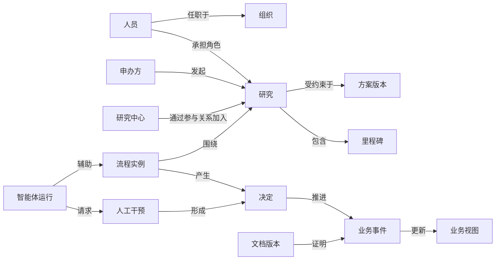

# CRO 企业本体、主数据、事件与指标字典

> 状态：候选基线，须通过企业现状盘点核验后发布 1.0 版  
> 日期：2026-08-06  
> 适用范围：Youlin 企业化 AI 中台、企业 OA、数据中台、知识中台与 CRO AI 原生工作台  
> 前置文档：[企业现状盘点与调研执行手册](./02-current-state-inventory.md)

## 0. 文档定位

本文件定义 Youlin 企业化建设所需的统一业务语言。它不是数据库设计稿，也不是把 CTMS、EDC、eTMF、QMS、ERP 的表结构重新抄一遍，而是回答：

1. 企业共同承认哪些业务对象；
2. 每个对象由哪个系统产生权威事实；
3. 不同系统中的同一对象如何建立稳定身份；
4. 状态变化意味着谁必须做什么；
5. 哪个业务事件证明生命周期已经推进或关闭；
6. 指标、知识、审批和 AI 动作如何引用同一业务语义；
7. 哪些定义已经核验，哪些仍是假设。

本文按阶段使用：MVP 1 落地 Person、Employment、Organization、Department、Group、Workspace、Resource Library、Resource Object、Resource Version、Share Grant、Knowledge Resource、Personal Memory、Artifact、Skill、Tool、Workflow、Agent，以及 DataSource、Dataset、DataProduct、DataContract、APIProduct、APIClient、Policy、AccessGrant 等平台核心概念；Study、Site、Protocol、TMF 等 CRO 领域对象保留为 MVP 2 候选模型，不进入首期关键路径。MVP 1 的 Project Resource Library 和低敏 Data Product 使用通用边界，不代表已进入临床 Study 受控范围。

本文的直接消费者包括：

- SSO、企业微信、账号关联、组织同步和权限策略；
- OA/BPM 流程和审批表单；
- 数据接入、湖仓、Data Product、API、主数据、指标语义层和管理看板；
- RAGFlow 知识元数据、检索过滤和引用；
- Dify 工作流输入输出；
- Youlin 智能体、工具与受控动作网关；
- 审计、验证、数据血缘和 Harness 发布门禁。

### 0.1 当前可信度

本文已获得企业组织图、主要系统/供应商清单、CRO 报价工具样本、员工工作指引、300～500 人规模、首期非 GxP 与数据不出境边界，但尚未完成结构化组织核验、源系统接口实测、员工指引所引用制度/SOP/WI 的完整盘点和一线用户跟岗。因此：

- Person、Employment、Organization、Department、岗位与项目组关系可基于组织图启动建模，但组织图不是可直接导入的主数据，仍以新人新事/选定组织真源核验结果为准；
- HR 新人新事、泛微 OA、自研 CRM、医渡定制 CTMS/EDC/IWRS/eTMF、用友财务等来源归属是当前候选基线，准确对象边界仍须通过 02 的系统盘点和数据样本确认；
- 报价工具可支持 Quote、Service Item、Role、Standard Effort、Timeline、Approval、Rebid/Change 等候选概念，不能替代实际工时、等待、返工和差错基线；
- 员工工作指引可支持 Guidance、Procedure Link、Role Task、Suggested Deadline、Contact Role 等导航概念，但其摘要不能覆盖当前有效制度、SOP/WI 或 OA 正式通知；
- 本文中的“候选”表示推荐的初始定义，不表示企业已经正式发布；
- 状态、动作和审批终态必须由业务负责人、质量与系统负责人共同签字确认；
- MVP 1 不纳入 CTMS、EDC、eTMF、ePRO、IWRS 的 GxP/Part 11 受控记录；受试者、安全病例、人遗等高敏感对象默认不进入通用 AI 上下文；
- 所有数据处理遵循不出境、不越出批准边界的当前基线；如本体与源系统冲突，先记录冲突，不直接覆盖源系统。

---

## 1. 建模原则

### 1.1 六条硬规则

1. **业务对象不等于系统表**：同一研究可能分布在 CTMS、ERP、eTMF 和 CRM 中，但企业身份只有一个。
2. **状态必须有义务**：不能只定义“待处理”，必须说明谁在什么时限内完成什么动作。
3. **动作必须产生事件**：按钮或智能体工具如果不能对应业务事件，就不能宣称业务已经发生。
4. **来源必须可追溯**：每个事实必须能回到源系统、源记录、版本和取得时间。
5. **决策与执行分离**：AI 可以形成建议，只有具备授权的规则、人或系统才能产生终态决定。
6. **时间不能被覆盖**：至少保留事实何时在业务上有效，以及系统何时得知该事实。

### 1.2 本体不做什么

- 不替代各业务系统的详细数据模型；
- 不让数据中台成为所有业务数据的新权威源；
- 不把页面菜单直接变成本体域；
- 不为追求统一而丢失国家、客户或研究特有语义；
- 不把相似名称自动判定为同一实体；
- 不允许 AI 自行创造主数据、批准记录或合规事实。

### 1.3 三层业务模型

| 层次 | 回答的问题 | 典型内容 | 治理责任 |
| --- | --- | --- | --- |
| 企业核心层 | 全公司共同承认什么 | 人、组织、研究、中心、文档、任务、决定 | 企业数据治理委员会 |
| CRO 领域层 | 临床研发服务如何运行 | 方案、国家启动、监查访问、数据质疑、安全病例、CAPA | 各业务域负责人 |
| 项目扩展层 | 特定客户/研究有什么差异 | 客户代码、研究特有里程碑、国家规则、定制指标 | Study 团队与数据管理员 |

项目扩展只能扩充核心概念，不能偷偷改变核心概念的定义。

---

## 2. 统一元模型

所有本体条目使用相同结构：

| 字段 | 含义 |
| --- | --- |
| 概念代码 | 稳定、不可复用的英文机器代码，如 `Study` |
| 中文名称 | 面向业务用户的标准称谓 |
| 定义 | 判断某个实例是否属于该概念的必要条件 |
| 非定义 | 容易混淆但不属于该概念的事物 |
| 权威来源 | 产生最终业务事实的系统或受控流程 |
| 业务负责人 | 对含义、规则和使用负责的人 |
| 数据管理员 | 对标识、质量、映射和问题处置负责的人 |
| 唯一标识 | 企业标识及源系统标识规则 |
| 生命周期 | 创建、有效、暂停、终止、归档等状态与事件 |
| 敏感级别 | 公开、内部、机密、敏感个人信息、高敏感等 |
| 允许用途 | 可以支持的业务、分析和 AI 用途 |
| 禁止用途 | 明确不得用于的场景 |
| 证据等级 | 已确认、待核验、候选 |

### 2.1 通用标识结构

每个跨系统核心对象至少携带：

```text
enterpriseId       企业稳定标识，不因源系统迁移而变化
objectType         本体概念代码
sourceSystem       当前事实来源系统
sourceRecordId     来源记录标识
sourceVersion      来源版本或乐观锁版本
validFrom/validTo  业务有效时间
recordedAt         平台取得该事实的时间
status             标准状态代码
classification     数据分类
provenance         来源、处理和映射证据
```

### 2.2 双时态要求

对于研究状态、人员任职、项目成员、中心状态、文档生效和指标口径，必须同时记录：

- **业务有效时间**：现实中从何时开始成立；
- **系统记录时间**：平台从何时开始知道。

这能回答“截至当时我们知道什么”，避免用今天修正后的数据重写历史审计事实。

---

## 3. 核心概念域

以下是候选核心字典。`权威来源` 必须在 02 调研中核验。

### 3.1 身份与组织域

| 代码 | 中文名称 | 候选定义 | 候选权威来源 | 关键关系 | 敏感级别 |
| --- | --- | --- | --- | --- | --- |
| `LegalEntity` | 法人实体 | 能独立承担合同、税务或监管责任的组织 | HR/ERP/法务 | 拥有部门、签署合同 | 内部 |
| `BusinessUnit` | 事业单元 | 承担经营目标的组织单元 | HR/ERP | 隶属法人 | 内部 |
| `Department` | 部门 | 稳定的行政组织单元 | HR | 隶属组织、拥有人岗 | 内部 |
| `Team` | 团队 | 围绕职能或任务形成的人员集合 | HR/协作平台 | 包含人员 | 内部 |
| `Person` | 自然人 | 经身份核验的员工或外部协作人员 | HR/IAM/外部身份源 | 具有任职与账号 | 个人信息 |
| `Employment` | 任职关系 | 人与法人之间有起止时间的雇佣或服务关系 | HR | 连接人、法人、岗位 | 个人信息 |
| `Position` | 岗位 | 组织中可被任职关系占据的职责位置 | HR | 属于部门 | 内部 |
| `BusinessRole` | 业务角色 | 在特定范围内承担一组职责的角色 | IAM/业务系统 | 获得权限与责任 | 内部 |
| `Delegation` | 委托 | 委托人在限定范围和时间内授权代理人代办 | OA/IAM | 连接人、权限、时间 | 机密 |
| `DigitalIdentity` | 数字身份 | 人或服务在 Keycloak 中的可认证身份；应用侧以 Keycloak `sub` 稳定引用 | Keycloak | 映射人员或服务，不替代 HR 人员主数据 | 机密 |
| `ServiceIdentity` | 服务身份 | 系统、工作负载或智能体调用工具时使用的非人身份 | IAM | 绑定应用与权限 | 机密 |

必须区分：

- “岗位”是组织位置，“业务角色”是特定范围内的责任；
- “账号”不是“人”，一个人可能有多个账号；
- “项目成员”不是行政部门成员；
- “委托”不是永久转权，必须有范围、期限和撤销记录；
- 智能体不能冒充用户身份，代理执行必须同时记录用户、智能体和服务身份。

### 3.2 客户、合作方与研究中心域

| 代码 | 中文名称 | 候选定义 | 候选权威来源 | 关键关系 |
| --- | --- | --- | --- | --- |
| `Organization` | 外部组织 | 与企业发生业务关系的外部法人或机构 | CRM/ERP | 可扮演多个组织角色 |
| `Sponsor` | 申办方 | 对临床试验发起、管理和经费承担责任的组织角色 | CRM/CTMS/合同 | 发起研究、签署合同 |
| `Vendor` | 供应商 | 为研究或企业提供产品与服务的组织角色 | ERP/采购 | 履行合同与交付物 |
| `Site` | 研究中心 | 经选择并可参与某项研究的医疗机构业务单元 | CTMS | 位于国家、参与研究 |
| `Investigator` | 研究者 | 在特定中心和研究中承担研究职责的自然人 | CTMS | 关联中心和研究 |
| `Contact` | 联系人 | 某组织关系中的沟通对象，不自动等于授权用户 | CRM | 关联组织 |
| `Contract` | 合同 | 由授权主体签署、定义权利义务的受控协议 | 合同系统/ERP | 连接组织、项目、预算 |

同一组织可以同时是客户、供应商或合作方，角色应建模在关系上，而不是复制多个组织实体。

### 3.3 临床研究域

| 代码 | 中文名称 | 候选定义 | 候选权威来源 | 终态或关键事件 |
| --- | --- | --- | --- | --- |
| `Portfolio` | 项目组合 | 按战略或经营目的管理的一组项目/研究 | 经营系统 | 组合批准/关闭 |
| `Program` | 研发计划 | 围绕产品或适应证组织的一组研究 | CTMS/客户系统 | 计划批准/结束 |
| `Study` | 临床研究 | 按一份方案开展并具有稳定企业身份的研究 | CTMS | 研究授权启动/关闭归档 |
| `Protocol` | 研究方案 | 描述研究目标、设计和执行要求的受控内容 | eTMF/文档系统 | 方案批准生效 |
| `ProtocolAmendment` | 方案修订 | 对已批准方案形成的新受控版本 | eTMF/文档系统 | 修订获批生效 |
| `StudyCountry` | 研究国家 | 某研究在特定国家开展的受控范围 | CTMS | 国家启动/关闭 |
| `StudySite` | 研究中心参与关系 | 某中心参与某研究的有时效业务关系 | CTMS | 中心激活/关闭 |
| `Subject` | 受试者 | 参加研究的自然人；平台默认仅处理去标识化身份 | EDC | 入组/完成/退出 |
| `Cohort` | 队列 | 按方案条件形成的受试者集合 | EDC/随机系统 | 队列锁定/关闭 |
| `Visit` | 访视 | 按方案计划或实际发生的研究接触时点 | EDC/CTMS | 访视完成 |
| `Milestone` | 里程碑 | 对研究推进有业务意义且可证实的节点 | CTMS | 里程碑达成/取消 |
| `Deliverable` | 交付物 | 按合同、计划或流程必须交付并验收的成果 | 项目/文档系统 | 验收/拒绝 |

关键区分：

- `Study` 不等于 ERP 的财务项目，也不等于 LobeHub 的工作空间；
- `Site` 是机构，`StudySite` 是该机构参与某研究的关系；
- `Protocol` 是受控内容，某个 PDF 只是它的一个文档载体；
- `Milestone` 必须有达成条件和证据，不能只是计划日期；
- 平台的 `Subject` 默认只能保存源系统去标识化键，不建立跨研究受试者画像。

### 3.4 临床运营域

| 代码 | 中文名称 | 定义 | 候选权威来源 |
| --- | --- | --- | --- |
| `MonitoringPlan` | 监查计划 | 规定监查策略、频次和责任的受控计划 | CTMS/eTMF |
| `MonitoringVisit` | 监查访问 | 针对某研究中心执行的计划内或触发式监查活动 | CTMS |
| `TripReport` | 监查报告 | 对监查活动、发现和结论的受控记录 | CTMS/eTMF |
| `ActionItem` | 行动项 | 有责任人、期限和关闭证据的纠正行动 | CTMS/任务系统 |
| `EnrollmentTarget` | 入组目标 | 特定范围和期间内批准的受试者目标 | CTMS/计划系统 |
| `EnrollmentActual` | 实际入组 | 经源系统确认的入组事实 | EDC/CTMS |
| `SiteRiskSignal` | 中心风险信号 | 由数据或规则产生、需要评估的异常信号 | 风险监查平台 |
| `Issue` | 业务问题 | 影响目标且需跟踪处置的已确认问题 | CTMS/任务系统 |

风险信号不是问题，问题也不是偏差：信号经评估后可能被关闭、转为问题或触发偏差调查。

### 3.5 数据管理与统计域

| 代码 | 中文名称 | 定义 | 候选权威来源 |
| --- | --- | --- | --- |
| `DataPoint` | 临床数据点 | 某受试者、表单、访视和字段上的数据事实 | EDC |
| `DataQuery` | 数据质疑 | 对临床数据点提出、等待答复和关闭的正式问题 | EDC |
| `EditCheck` | 编辑检查 | 对临床数据执行的版本化校验规则 | EDC/数据管理平台 |
| `DataReviewFinding` | 数据审查发现 | 人工或算法发现、尚待裁决的数据问题 | 数据审查平台 |
| `DatabaseLock` | 数据库锁定 | 经授权确认数据达到锁库条件的业务事件 | EDC |
| `AnalysisDataset` | 分析数据集 | 按已批准规范生成、可用于统计分析的数据产品 | 统计平台 |
| `StatisticalOutput` | 统计输出 | 表、图、清单或模型结果的受控版本 | 统计平台/文档系统 |

AI 可辅助发现、分类和起草质疑，但不得自行修改临床数据或宣称数据库已经锁定。

### 3.6 安全与药物警戒域

| 代码 | 中文名称 | 定义 | 候选权威来源 |
| --- | --- | --- | --- |
| `SafetyCase` | 安全病例 | 围绕一名可识别患者、报告者、可疑药物和事件形成的病例记录 | PV 系统 |
| `AdverseEvent` | 不良事件 | 用药后发生的任何不利医学事件 | EDC/PV |
| `SeriousAdverseEvent` | 严重不良事件 | 满足严重性标准的不良事件 | EDC/PV |
| `SafetySignal` | 安全信号 | 提示潜在新风险或已知风险变化、需要评估的信息 | PV 信号系统 |
| `SafetySubmission` | 安全递交 | 按监管要求向机构提交的受控报告 | PV 系统 |
| `MedicalAssessment` | 医学评估 | 由具备资格人员作出的严重性、因果性等判断 | PV 系统 |

严重性、预期性、因果性等医学判断不得由通用智能体形成终态事实。智能体可抽取和提示，但终态必须绑定有资格的人员和签名。

### 3.7 文档、知识与培训域

| 代码 | 中文名称 | 定义 | 候选权威来源 |
| --- | --- | --- | --- |
| `ResourceLibrary` | 资源库 | 按个人、团队、企业或项目范围组织资源和权限的逻辑容器 | Youlin 资源中心 |
| `ResourceFolder` | 资源文件夹/集合 | 在资源库内组织资源引用、排序和分类的逻辑节点 | Youlin 资源中心 |
| `ResourceObject` | 资源对象 | 具有稳定企业 ID、Owner、密级和生命周期的文件或结构化资源 | Youlin 资源中心 |
| `ResourceVersion` | 资源版本 | 资源对象某次不可变内容版本，正文保存于企业 OSS | Youlin 资源中心/OSS |
| `PreviewRendition` | 预览衍生物 | 从确定资源版本生成的 PDF、图片、缩略图或转码内容 | 预览服务/OSS |
| `ShareGrant` | 分享授权 | 将资源权限授予用户、Group、部门、项目或企业并带有效期的授权事实 | Youlin 权限中心 |
| `ControlledDocument` | 受控文档 | 经规定审批、版本、生效和废止控制的内容对象 | eTMF/QMS/文档系统 |
| `DocumentVersion` | 文档版本 | 某受控文档在特定时间有效的不可变内容版本 | 文档权威系统 |
| `Artifact` | 工作产物 | Agent、Tool、Workflow 或人工任务产生、未必受控的文件或结构化成果 | Youlin 工作平台/OSS |
| `PersonalMemory` | 个人记忆 | 用户可查看和管理、用于个性化上下文的服务端长期记忆记录 | Youlin 记忆服务 |
| `MemorySnapshot` | 记忆快照 | 某条记忆在特定时间的正文、附件或导出版本 | Youlin 记忆服务/OSS |
| `TMFArtifact` | TMF 文档实例 | 按 TMF 分类、研究和国家/中心归档的受控记录 | eTMF |
| `KnowledgeSource` | 知识源 | 从确定 ResourceVersion 经批准用于检索增强生成的知识输入 | Youlin 知识治理目录 |
| `KnowledgeRelease` | 知识发布 | 一组确定资源版本向确定人群和用途生效的发布 | RAGFlow/知识治理 |
| `TrainingRequirement` | 培训要求 | 角色或任务必须完成的课程和时限要求 | LMS/QMS |
| `TrainingRecord` | 培训记录 | 某人完成特定课程版本的可验证事实 | LMS |

资源库不等于知识库，Artifact 不等于受控文档，个人记忆也不等于企业事实。知识索引不是权威文档；RAGFlow 中的切片、向量和摘要都必须回到 `ResourceObject + ResourceVersion`。文件原件、版本、预览衍生物、记忆载荷和产出物保存在企业 OSS，PostgreSQL 保存可查询元数据和权限，派生索引必须可重建。

### 3.8 数据产品与 API 域

| 代码 | 中文名称 | 定义 | 关键要求 |
| --- | --- | --- | --- |
| `DataSource` | 数据源 | 提供数据的系统、接口、文件或事件源 | Owner、网络区、接入方式和 SLA 明确 |
| `Dataset` | 数据集 | 可登记和治理的表、视图、文件集合或事件流 | 有稳定 ID、Schema、分类和血缘 |
| `DatasetVersion` | 数据集版本 | 某一确定 Schema、分区或快照版本 | 可重现、可比较 |
| `DataProduct` | 数据产品 | 面向消费者发布、有 Owner 和 SLA 的数据服务单元 | 不等于底层表 |
| `DataContract` | 数据契约 | Schema、质量、兼容性和服务等级约定 | 版本化并进入契约测试 |
| `MetricDefinition` | 指标定义 | 公式、粒度、时间口径和维度的版本化定义 | 有业务 Owner |
| `APIProduct` | API 产品 | 以业务边界组合的一组 API | 绑定 Data Product 和生命周期 |
| `APIVersion` | API 版本 | 确定的 OpenAPI/Schema 契约 | 破坏性变更升主版本 |
| `APIClient` | API 客户端 | 内部或外部消费应用在 Keycloak 中的身份 | 每应用/环境隔离 |
| `Subscription` | 订阅 | API Client 对 Data Product/API 的消费关系 | 有范围、用途和状态 |
| `Policy` | 策略 | RBAC/ABAC、行列、脱敏、用途和配额规则 | 版本化、可审计 |
| `AccessRequest` | 访问申请 | 对数据/API 权限的正式请求 | 记录用途、字段、范围和期限 |
| `AccessGrant` | 访问授权 | 经批准且可执行的限时权限 | 到期自动回收 |
| `DataQualityRule` | 数据质量规则 | 完整性、唯一性、及时性、一致性或范围检查 | 有阈值和 Owner |
| `LineageEdge` | 血缘边 | 数据源、转换、Dataset、Metric、API 之间的派生关系 | 支持影响分析 |
| `DataExport` | 数据导出 | 经审批生成的批量交付物 | Hash、水印、接收方和到期删除 |

数据产品不替代源系统权威事实，API Client 不等于员工账号，发现权限不等于获得查询/下载权限。Youlin 管理控制面元数据；湖仓存储和计算位于独立数据面。

### 3.9 质量与合规域

| 代码 | 中文名称 | 定义 | 候选权威来源 |
| --- | --- | --- | --- |
| `Deviation` | 偏差 | 对批准流程、方案或要求的已确认偏离 | QMS |
| `Finding` | 发现项 | 审计、检查或质量活动识别的事实与证据 | QMS |
| `CAPA` | 纠正与预防措施 | 针对根因制定、实施并验证有效性的受控行动 | QMS |
| `Audit` | 审计 | 按批准范围和计划进行的独立、系统性检查 | QMS |
| `Inspection` | 监管检查 | 监管机构实施的正式检查活动 | QMS |
| `ChangeControl` | 变更控制 | 对受控系统、流程或配置变更进行评估和批准的流程 | QMS/ITSM |
| `ValidationEvidence` | 验证证据 | 证明系统或流程适合预期用途的受控证据 | QMS/验证库 |
| `ElectronicSignature` | 电子签名 | 与记录、身份、时间及签名含义绑定的不可抵赖行为 | 签名服务/业务系统 |
| `LegalHold` | 法律保全 | 暂停特定记录正常销毁的法律控制 | 法务/记录管理 |

### 3.10 商务、合同与财务域

| 代码 | 中文名称 | 定义 | 候选权威来源 |
| --- | --- | --- | --- |
| `Opportunity` | 商机 | 处于跟踪和决策中的潜在客户业务 | CRM |
| `Proposal` | 提案 | 面向客户提交的范围、方案与商务响应 | CRM/文档系统 |
| `BudgetVersion` | 预算版本 | 某范围和假设下经版本控制的预算 | ERP/预算系统 |
| `PurchaseRequest` | 采购申请 | 请求采购货物或服务的业务记录 | OA/采购系统 |
| `PurchaseOrder` | 采购订单 | 经批准向供应商发出的采购承诺 | ERP |
| `Invoice` | 发票 | 应收或应付的正式财务凭证 | ERP |
| `RevenueRecognition` | 收入确认 | 按适用规则确认收入的会计事实 | ERP |
| `CostActual` | 实际成本 | 已发生并入账的成本事实 | ERP |

AI 可以解释预算差异或起草申请，但不得自行批准预算、采购、付款或收入确认。

### 3.11 工作、流程与决策域

| 代码 | 中文名称 | 定义 | 关键要求 |
| --- | --- | --- | --- |
| `WorkItem` | 工作项 | 需要被跟踪到关闭的工作单元 | 有责任人、状态、期限和范围 |
| `Assignment` | 分派 | 将工作责任赋予某人或某角色的事件 | 记录分派者、接受规则和时间 |
| `ProcessDefinition` | 流程定义 | 描述业务流程结构和规则的受控定义 | 可版本化 |
| `ProcessVersion` | 流程版本 | 已发布且不可变的流程定义版本 | 运行实例绑定版本 |
| `ProcessInstance` | 流程实例 | 一次具体业务流程的完整生命周期 | 关联业务对象和发起人 |
| `ApprovalTask` | 审批任务 | 要求有资格人员作出正式决定的待办 | 记录候选人、经办人、时限 |
| `Decision` | 决定 | 授权主体对明确问题作出的结论 | 有决定者、依据、含义和时间 |
| `Intervention` | 人工干预 | 自动流程因风险、不确定性或权限而等待人工处理 | 阻塞自动动作 |
| `Escalation` | 升级 | 因时限或风险将处理责任提升的事件 | 不等于批准 |
| `Notification` | 通知 | 向接收人传达事实的消息 | 默认不产生审批终态 |

### 3.12 AI 与自动化域

| 代码 | 中文名称 | 定义 | 关键要求 |
| --- | --- | --- | --- |
| `Model` | 模型 | 可执行推理或生成的版本化模型 | 供应商、版本、部署位置可追踪 |
| `PromptTemplate` | 提示词模板 | 具有版本和用途边界的提示词资产 | 变更需评测 |
| `AgentDefinition` | 智能体定义 | 组合模型、提示词、知识、工具和策略的版本化定义 | 有负责人和禁止用途 |
| `WorkflowDefinition` | AI 工作流定义 | 编排模型、规则和工具步骤的版本化定义 | 输入输出契约明确 |
| `AgentRun` | 智能体运行 | 某版本智能体针对明确业务对象的一次执行 | 端到端追踪 |
| `ToolDefinition` | 工具定义 | 智能体可调用的受控能力描述 | 读写、风险、权限分级 |
| `ToolInvocation` | 工具调用 | 某次运行对工具的具体请求与结果 | 幂等、审计、脱敏 |
| `EvaluationDataset` | 评测数据集 | 用于验证质量、安全和业务效果的版本化案例集合 | 来源和授权清晰 |
| `EvaluationResult` | 评测结果 | 特定资产版本在特定评测集上的结果 | 不跨版本挪用 |
| `HumanReview` | 人工复核 | 有资格人员对 AI 输出进行接受、修改或拒绝 | 与最终决定分开记录 |

---

## 4. 关键跨域关系

关系必须有方向、有效期、来源和基数，不能只保存模糊标签。

| 关系代码 | 主体 | 关系 | 客体 | 关键约束 |
| --- | --- | --- | --- | --- |
| `MEMBER_OF` | 人 | 是……成员 | 部门/团队 | 有起止时间 |
| `ASSIGNED_TO_STUDY` | 人 | 被分派到 | 研究 | 包含业务角色和国家/中心范围 |
| `PARTICIPATES_IN` | 研究中心 | 参与 | 研究 | 以 `StudySite` 关系承载状态 |
| `GOVERNED_BY` | 研究 | 受……约束 | 方案版本 | 只能引用当时生效版本 |
| `PRODUCES` | 流程实例 | 产生 | 交付物/决定/事件 | 产物可追溯到流程版本 |
| `EVIDENCES` | 文档/回执 | 证明 | 事件/决定 | 证据不可被摘要替代 |
| `REQUIRES_APPROVAL` | 业务对象 | 需要 | 审批任务 | 说明决定含义 |
| `DERIVED_FROM` | 数据产品/指标 | 派生自 | Dataset/数据对象 | 保存转换、Schema 和版本 |
| `EXPOSED_BY` | 数据产品 | 通过……提供 | API/Metric/Event/Export | 绑定契约和版本 |
| `SUBSCRIBED_BY` | API/Data Product | 被……订阅 | API Client | 有用途、范围、配额和期限 |
| `GOVERNED_BY_POLICY` | Dataset/API | 受……约束 | Policy/AccessGrant | 可回溯授权和策略版本 |
| `INDEXED_FROM` | 知识切片 | 索引自 | 文档版本 | 一对一回到来源版本 |
| `AUTHORIZED_FOR` | 身份/角色 | 被授权用于 | 动作+对象范围 | 有用途和期限 |
| `ACTS_ON_BEHALF_OF` | 智能体运行 | 代表 | 用户/服务主体 | 不改变原主体权限上限 |
| `TRIGGERED_BY` | 工作流运行 | 由……触发 | 业务事件 | 需去重与防循环 |
| `WRITES_BACK_TO` | 工具调用 | 写回 | 权威系统记录 | 需要期望版本和执行回执 |
| `SUPERSEDES` | 新版本 | 替代 | 旧版本 | 旧版本保留，不物理覆盖 |

### 4.1 核心关系图



---

## 5. 企业主数据与身份解析

### 5.1 候选主数据分级

| 级别 | 对象 | 管理方式 |
| --- | --- | --- |
| 一级企业主数据 | 法人、组织、人员、外部组织、研究、研究中心 | 企业统一标识与集中映射 |
| 二级领域主数据 | 方案、国家、研究者、供应商、文档分类、业务角色 | 领域治理并向企业目录发布 |
| 参考数据 | 国家、币种、时区、术语、状态原因、严重性分类 | 版本化代码集 |
| 项目局部数据 | 研究特有队列、里程碑、交付物类型 | 项目范围治理，不提升为企业标准 |

### 5.2 标识映射表

| 企业标识 | 对象类型 | 源系统 | 源标识 | 匹配方式 | 置信度 | 生效时间 | 失效时间 | 裁决人 |
| --- | --- | --- | --- | --- | --- | --- | --- | --- |
| 待生成 | `Study` | CTMS | 待填写 | 人工确认 | 高 | 待填写 | — | 待填写 |

### 5.3 实体解析顺序

1. 使用已确认的源系统稳定标识；
2. 使用经治理的跨系统映射；
3. 使用强业务键组合并要求人工确认；
4. 模糊匹配只能生成候选，不能自动合并；
5. 合并和拆分必须保存原标识、理由、操作者和影响评估。

禁止仅凭名称、简称、邮箱或文件名自动合并研究、中心、人员和供应商。

### 5.4 主数据冲突裁决

冲突处理不是“最后写入者获胜”。每个字段应配置：

- 字段级权威来源；
- 来源优先级和适用条件；
- 人工裁决角色；
- 临时值是否允许；
- 冲突期间下游系统如何降级；
- 修复后是否重算历史指标和知识索引。

---

## 6. 状态、义务与业务事件

### 6.1 状态定义模板

| 字段 | 说明 |
| --- | --- |
| 对象与状态代码 | 如 `ApprovalTask.AWAITING_DECISION` |
| 中文名称 | 如“待审批” |
| 业务含义 | 当前已经成立的事实 |
| 当前义务 | 谁必须在何时前做什么 |
| 进入事件 | 哪个事件使状态成立 |
| 允许动作 | 当前状态允许的动作 |
| 退出事件 | 哪个事件终止该状态 |
| 超时后果 | 升级、替补、终止或继续等待 |
| 终态标识 | 是否关闭生命周期 |

### 6.2 审批任务候选状态机

| 状态 | 业务义务 | 可执行动作 | 终态 |
| --- | --- | --- | --- |
| 待分派 | 系统必须确定候选审批人 | 分派、终止 | 否 |
| 待审批 | 经办人必须在时限内决定 | 批准、拒绝、退回、转办、加签 | 否 |
| 等待补充 | 发起人必须提交指定材料 | 补充、撤回 | 否 |
| 已批准 | 规定的批准条件全部满足 | 执行后续动作 | 是/视流程而定 |
| 已拒绝 | 有资格审批人作出拒绝决定 | 重新发起 | 是 |
| 已撤回 | 发起人在允许条件下结束申请 | 重新发起 | 是 |
| 已终止 | 授权主体因异常或政策结束流程 | 申诉/重启 | 是 |
| 已过期 | 时限已过且政策规定不再有效 | 重新发起/升级 | 是或待升级 |

### 6.3 业务事件命名

事件使用已经发生的过去式事实，推荐形式：

```text
<对象>.<事实>
Study.Created
Study.AuthorizedToStart
StudySite.Activated
MonitoringVisit.Completed
TripReport.Approved
DataQuery.Closed
Database.Locked
SafetyCase.Submitted
CAPA.EffectivenessVerified
ApprovalTask.Decided
KnowledgeRelease.Published
ToolInvocation.Executed
```

避免使用模糊事件：`Updated`、`Processed`、`Handled`、`Done`。它们不能说明业务究竟发生了什么。

### 6.4 事件最小信封

```text
eventId             全局唯一事件标识
eventType           本体事件代码
occurredAt          业务发生时间
recordedAt          平台记录时间
actor               用户、服务与智能体身份
businessObject      对象类型、企业标识、源标识
scope               租户、法人、研究、国家/中心范围
causationId          直接原因事件
correlationId        跨系统业务链路标识
source               权威系统与记录版本
payloadSchemaVersion 负载契约版本
classification       数据分类
evidence             决定、签名、文档或执行回执引用
```

### 6.5 事件处理要求

- 至少一次投递时必须依靠 `eventId` 幂等；
- 消费者不得假设事件严格有序；
- 迟到事件按业务有效时间修正视图，但不得静默改写审计记录；
- 重放事件必须可区分生产事实和技术重放；
- 包含个人或临床数据时，事件负载仅放最小必要字段；
- 失败进入隔离队列，并有人工处置与补偿记录。

---

## 7. 审批与决定语义

### 7.1 决定最小契约

每个正式决定必须记录：

- 决定的问题与业务对象；
- 决定类型和含义；
- 决定者身份、资格、角色和作用范围；
- 决定时看到的材料及版本；
- 决定、理由和附加条件；
- 日期、时间和时区；
- 是否使用电子签名及签名含义；
- 是否由代理人执行及委托依据；
- AI 是否提供摘要或建议；
- 后续业务事件和执行回执。

### 7.2 动作与业务后果

| 界面动作 | 必须产生的业务事实 | 不得隐含的含义 |
| --- | --- | --- |
| 提交 | 申请进入规定审核范围 | 不等于已批准 |
| 批准 | 有资格人员同意明确事项 | 不自动等于后续执行成功 |
| 拒绝 | 当前申请生命周期按规则关闭 | 不等于删除记录 |
| 退回补充 | 申请仍存在并等待指定材料 | 不等于拒绝 |
| 撤回 | 发起人按规则结束或暂停申请 | 不等于审批人拒绝 |
| 转办 | 当前经办责任转移 | 不自动转移最终批准资格 |
| 加签 | 增加一个必要或征询决定 | 不应抹去原审批链 |
| 执行 | 已批准动作在目标系统成功完成 | 必须有目标系统回执 |

### 7.3 AI 参与边界

| 能力 | AI 可做 | 终态产生者 |
| --- | --- | --- |
| 材料收集 | 抽取、分类、缺项提醒 | 系统规则/经办人确认 |
| 合规核验 | 检索条款、指出冲突 | 质量/法务/合规人员 |
| 审批摘要 | 汇总事实、引用证据 | 不产生终态 |
| 意见起草 | 生成可编辑草稿 | 审批人签署 |
| 路由建议 | 推荐审批路径 | BPM 规则或管理员 |
| 低风险执行 | 在已批准策略内调用受控工具 | 动作网关和目标系统 |
| 高风险决定 | 只提示风险和待确认项 | 有资格的授权人员 |

---

## 8. 指标语义模型

### 8.1 指标不是一个数字

一个可治理指标至少包括：

```text
metricCode          稳定指标代码
name                中文名称
decisionSupported   支持什么业务决定
definition          业务定义
formula             计算公式
grain               最小计算粒度
dimensions          允许分析维度
population          纳入与排除条件
timeBasis           事件时间、自然日/工作日、时区
sourceFacts         权威事实与事件
refreshPolicy       刷新和延迟承诺
qualityRules        完整性与异常阈值
owner/steward       业务负责人和数据管理员
version             口径版本与生效时间
```

### 8.2 候选指标字典

以下指标仅是候选口径，发布前必须由业务和数据负责人确认。

| 代码 | 中文名称 | 支持的决定 | 候选公式/口径 | 粒度 | 权威事实 |
| --- | --- | --- | --- | --- | --- |
| `STUDY_MILESTONE_OTD` | 研究里程碑按期率 | 哪些研究需要干预 | 按期达成里程碑数/到期里程碑数 | 研究/期间 | 里程碑计划与达成事件 |
| `SITE_ACTIVATION_CYCLE` | 中心启动周期 | 启动瓶颈在哪里 | 中心激活时间－启动流程开始时间 | 研究中心 | 流程开始与中心激活事件 |
| `SITE_ACTIVATION_OTD` | 中心按期激活率 | 哪些国家/中心延期 | 按计划激活中心数/应激活中心数 | 国家/研究 | 基线计划与激活事件 |
| `ENROLLMENT_ATTAINMENT` | 入组达成率 | 是否需要调整中心策略 | 实际入组/期间目标 | 研究/中心/期间 | EDC 入组事实与批准目标 |
| `MONITORING_REPORT_CYCLE` | 监查报告周期 | 报告积压在哪里 | 报告批准时间－访问结束时间 | 访问 | 访问完成与报告批准事件 |
| `OPEN_ACTION_AGING` | 未关闭行动项账龄 | 哪些行动需要升级 | 当前时间－行动项创建时间 | 行动项 | 行动项状态事件 |
| `QUERY_AGING` | 数据质疑账龄 | 数据清理是否受阻 | 关闭或当前时间－提出时间 | 数据质疑 | EDC 质疑事件 |
| `QUERY_REOPEN_RATE` | 数据质疑重开率 | 处理质量是否下降 | 重开质疑数/已关闭质疑数 | 研究/中心 | 质疑关闭与重开事件 |
| `TMF_TIMELINESS` | TMF 归档及时率 | 文档完整性是否有风险 | 时限内归档数/应归档数 | 文档类型/研究 | 文档产生、归档事件 |
| `CAPA_ON_TIME_CLOSE` | CAPA 按期关闭率 | 质量风险是否积压 | 按期有效关闭数/到期 CAPA 数 | 部门/研究 | CAPA 计划与有效性验证事件 |
| `BUDGET_BURN_VARIANCE` | 预算消耗偏差 | 成本是否失控 | 实际成本－计划成本，及偏差率 | 项目/期间 | ERP 入账与预算版本 |
| `APPROVAL_CYCLE` | 审批周期 | OA 流程是否阻塞 | 终态决定时间－正式提交时间 | 流程类型 | 提交与决定事件 |
| `AI_ACCEPTANCE_RATE` | AI 建议采纳率 | AI 是否真正有用 | 未实质修改即采纳数/已复核输出数 | 场景/版本 | AI 输出与人工复核 |
| `AI_ESCAPED_ERROR_RATE` | AI 漏出错误率 | AI 风险是否可控 | 上线后发现的严重错误/总输出 | 场景/版本 | 质量事件与运行证据 |

### 8.3 指标显示规则

- 显示数值同时显示数据截止时间、口径版本和质量状态；
- 零值必须区分“真实为零”“尚无数据”“数据失败”；
- 可从聚合指标下钻到来源事实，但仍受权限控制；
- 历史看板默认按当时生效口径展示，重算结果另存版本；
- AI 不得在没有指标定义时自行计算并命名“企业 KPI”。

---

## 9. 知识本体与 RAGFlow 元数据

### 9.1 最小知识元数据

每个进入企业知识库的文档版本至少包含：

| 元数据 | 用途 |
| --- | --- |
| 文档企业标识与版本 | 唯一定位和替换 |
| 来源系统与原文链接 | 回到权威记录 |
| 文档类型与本体概念 | 检索过滤和解释 |
| 所属研究/国家/中心 | 数据隔离与上下文匹配 |
| 状态与生效/失效时间 | 排除草稿和过期内容 |
| 业务负责人和批准人 | 治理与问题处置 |
| 数据分类与访问范围 | 检索前授权 |
| 允许用途与禁止用途 | 按目的限制 AI 使用 |
| 语言、地域和适用法规 | 避免错误套用 |
| 解析、切分和嵌入版本 | 可重复检索结果 |
| 发布批次与索引时间 | 定位知识发布版本 |

### 9.2 检索授权顺序

1. 认证用户和服务身份；
2. 确认业务用途；
3. 确认法人、研究、国家/中心范围；
4. 过滤文档状态、版本与有效期；
5. 在有权语料内召回和重排；
6. 返回引用、版本、有效期和置信提示；
7. 记录检索证据，不在模型生成后补做权限过滤。

### 9.3 知识冲突规则

- 生效版本优先于草稿或废止版本；
- 特定研究批准文件优先于通用模板，但只在该研究范围适用；
- 法规、客户要求和内部 SOP 冲突时不自动裁决，必须显示冲突并升级；
- 来源不明、版本缺失或权限不明的文档不得进入受控知识发布；
- 模型总结不是新的受控知识，除非经过独立审核和发布流程。

---

## 10. Dify、Youlin 与动作网关契约

### 10.1 标准 AI 工作流输入

```text
requestId           请求标识
purpose             明确业务用途
actor               用户、服务和智能体身份
scope               法人、研究、国家/中心范围
businessObject      本体对象与稳定标识
inputVersion        输入事实版本
dataClassification  数据分类
allowedTools        经策略计算后的工具集合
knowledgeRelease    允许使用的知识发布版本
expectedOutput      输出结构与质量要求
deadline            截止时间
```

### 10.2 标准 AI 工作流输出

```text
runId               运行标识
assetVersions       模型、提示词、智能体和工作流版本
result              结构化结果
citations           来源文档与精确位置
confidence          可解释的置信提示，不伪装成概率事实
uncertainties       冲突、缺失和无法确定项
policyDecisions     安全和权限策略结果
recommendedActions  建议动作，不代表已执行
reviewRequirement   人工复核角色和原因
traceId             端到端追踪标识
```

### 10.3 写操作契约

所有修改权威系统的调用必须额外包含：

- `actionType`：精确业务动作；
- `expectedVersion`：防止覆盖新事实；
- `idempotencyKey`：避免重复执行；
- `approvalId`：需要审批时引用有效决定；
- `reason`：业务理由；
- `dryRun`：支持预检查时先返回预计影响；
- `compensationPlan`：失败后的补偿或人工处置；
- `receipt`：目标系统生成的执行回执。

工具风险候选分级：

| 级别 | 类型 | 示例 | 默认控制 |
| --- | --- | --- | --- |
| T0 | 公开只读 | 读取公开术语 | 可直接执行 |
| T1 | 内部只读 | 读取获授权研究摘要 | 身份、用途和范围过滤 |
| T2 | 低风险创建 | 创建个人草稿、待办 | 告知用户，可撤销 |
| T3 | 受控写回 | 更新 CTMS 行动项 | 人工批准、乐观锁、回执 |
| T4 | 高风险/终态 | 批准付款、锁库、递交安全报告 | 智能体禁止形成终态 |

---

## 11. SSO、组织和权限语义映射

### 11.1 身份声明不等于业务授权

OIDC/SAML 登录声明可以证明“是谁”，不能单独证明“能对哪个研究做什么”。授权至少组合：

- 企业/租户；
- 法人和部门；
- 业务角色；
- 研究、国家、中心或项目范围；
- 数据分类和处理用途；
- 时间范围；
- 委托关系；
- 职责分离规则；
- 是否为人、服务或智能体身份。

### 11.2 候选授权语句

```text
主体 Person:P123
以角色 StudyProjectManager
在范围 Study:S456
为用途 StudyOperations
可对资源 Milestone
执行动作 Read/CreateProposal
但不得 FinalApprove
有效至 2027-01-31
```

### 11.3 权限决策证据

每次高风险读取或动作至少保存：

- 主体及认证强度；
- 请求目的和对象范围；
- 命中的角色、关系和策略版本；
- 允许/拒绝结论及原因；
- 使用的委托或紧急授权；
- 对应工具调用和业务回执。

---

## 12. 从本体到数据产品和页面

本体约束业务真实性，但页面应围绕用户任务组织，不能照搬本体目录。

| 用户任务 | 主要查找对象 | 首屏需要回答 | 关联本体 |
| --- | --- | --- | --- |
| 处理我的待办 | 等待本人决定或补充的事项 | 什么被我阻塞、风险和时限 | 审批任务、决定、干预、升级 |
| 判断研究是否偏航 | 需要干预的研究 | 哪些目标偏离、原因、责任人 | 研究、里程碑、风险信号、行动项 |
| 准备中心启动 | 尚未满足条件的中心 | 缺什么、由谁补、何时到期 | 研究中心参与关系、文档、里程碑 |
| 核验 SOP | 当前适用的受控知识 | 哪个版本有效、适用范围和依据 | 文档版本、知识发布、培训要求 |
| 解释经营差异 | 有异常的项目/期间 | 差异来自工作量、进度还是成本 | 合同、预算、成本、里程碑 |

数据产品建议按用户决策提供，而不是按源系统镜像提供：

- 研究健康度数据产品；
- 中心启动准备度数据产品；
- 质量风险与 CAPA 数据产品；
- 企业待办与审批数据产品；
- 受控知识证据服务；
- AI 运行与质量证据数据产品。

---

## 13. 物理实现建议

### 13.1 推荐分层

```text
源系统适配层
  └─ 保留源标识、源状态和原始时间
标准契约层
  └─ 映射企业标识、标准概念、关系和事件
主数据与本体层
  └─ 标识解析、代码集、关系、规则和版本
语义服务层
  ├─ 对象 API
  ├─ 关系与权限 API
  ├─ 指标 API
  ├─ 知识上下文 API
  └─ 事件订阅
用户任务层
  └─ 工作台、OA、看板、Dify 和智能体
```

### 13.2 建议的仓库边界

二开落地时可采用以下边界，具体名称在技术设计阶段确认：

```text
packages/
  enterprise-domain/       # 领域类型、代码集、契约
  enterprise-policy/       # 授权与用途策略
  enterprise-events/       # 事件信封与事件目录
  enterprise-metrics/      # 指标定义与计算契约
apps/server/src/
  modules/enterprise/      # 无数据库依赖的领域服务
  services/enterprise/     # 数据库与外部系统编排
  routers/...              # 对外接口
src/features/
  EnterpriseWorkbench/     # 按用户任务组织的业务界面
```

不得把企业领域业务逻辑放在 `src/app/(backend)` 路由壳中，也不要直接修改 LobeHub 通用 `Agent`、`Message` 等概念去承载所有 CRO 语义。

### 13.3 数据库存储候选

| 类型 | 推荐方式 | 原因 |
| --- | --- | --- |
| 稳定核心对象 | 明确关系表 | 约束、查询与审计清晰 |
| 多源标识 | 独立标识映射表 | 支持合并、拆分和追踪 |
| 有效期关系 | 带有效时间的关系表 | 支持历史权限和项目成员 |
| 领域事件 | 追加写事件表/事件总线 | 解耦和可重放 |
| 来源快照 | 不可变原始区 | 保留原始证据 |
| 扩展属性 | 受契约约束的 JSON | 支持项目差异但避免无治理字段堆积 |
| 指标结果 | 语义层/分析库 | 与交易负载分离 |
| 文档向量 | RAGFlow/向量存储 | 不替代文档权威记录 |

---

## 14. 本体治理与版本发布

### 14.1 角色

| 角色 | 职责 |
| --- | --- |
| 企业本体委员会 | 批准核心概念、跨域关系和重大变更 |
| 业务负责人 | 对定义、规则、用途和终态负责 |
| 数据管理员 | 对标识、映射、质量和问题处置负责 |
| 系统负责人 | 证明源系统行为和接口能力 |
| 安全/隐私 | 审批数据分类、用途、保留和跨境控制 |
| QA/验证 | 确定受控范围、验证证据和变更影响 |
| AI 治理 | 审核智能体用途、评测和人工监督 |

### 14.2 变更类型

| 类型 | 示例 | 兼容性 | 要求 |
| --- | --- | --- | --- |
| 补充说明 | 改善中文定义 | 兼容 | 同行评审 |
| 新增可选概念/字段 | 增加风险信号来源 | 通常兼容 | 领域批准、契约测试 |
| 收紧规则 | 字段由可选改为必填 | 可能破坏 | 影响分析、迁移计划 |
| 更改含义 | “关闭”定义变化 | 破坏 | 新版本、双轨期、重算评估 |
| 合并/拆分概念 | 供应商角色重构 | 破坏 | 标识迁移、权限和指标影响 |
| 废止 | 停用旧代码 | 有过渡期 | 替代项、截止日期、使用扫描 |

### 14.3 发布包

每版本体发布至少包括：

- 概念、关系、事件和指标变更日志；
- 机器可读契约和代码集；
- 源系统映射更新；
- 数据迁移和回填计划；
- API、Dify、RAGFlow、权限和看板影响；
- 测试与验证证据；
- 回滚或双轨兼容方案；
- 负责人批准记录。

Harness 负责契约、代码和配置的交付门禁，但业务语义批准仍由本体治理流程完成。

---

## 15. 从候选稿到 1.0 版的实施计划

### 第 1 步：锁定平台 MVP 语义范围

不要一次核验全文。MVP 1 先确认员工、身份、组织、部门、用户组、Workspace、个人/团队/企业/项目资源库、资源对象与版本、分享授权、个人记忆、产出物、权限、Skill、Tool、Workflow、Agent、知识发布和引用等平台概念，并通过资源中心与“有临员工工作助手”验证。

输出：身份和组织权威源、稳定标识、账号关联、资源范围、权限动作、发布状态、审计事件和知识版本语义。中心启动、监查、TMF 等临床闭环在 MVP 2 按场景继续核验。

### 第 2 步：抽取真实样本

至少选择：

- 5 个正常完成案例；
- 3 个退回、撤回或超期案例；
- 2 个跨系统数据冲突案例；
- 2 个权限或代理案例；
- 1 个审计或质量关注案例。

### 第 3 步：共同定义语义

业务、系统、数据、QA 和一线用户逐项确认：

- 对象定义与非定义；
- 企业标识和来源标识；
- 关系及有效期；
- 状态义务；
- 动作产生的业务事件；
- 终态决定者和证据；
- 指标口径；
- AI 允许与禁止边界。

### 第 4 步：形成机器可读契约

将已批准部分落实为：

- TypeScript 类型与枚举；
- JSON Schema/OpenAPI 契约；
- 事件目录；
- 数据库约束与迁移；
- 权限策略测试；
- 指标单元测试；
- RAG 元数据校验；
- Dify 输入输出校验。

### 第 5 步：建立最小语义服务

MVP 1 只实现平台闭环需要的：

- 员工与外部身份解析；
- 部门、用户组和成员关系查询；
- 资源范围和权限决策；
- Skill、Tool、Workflow、Agent 发布状态；
- 四级资源库、资源版本、分享授权、回收站和 OSS 对象映射；
- 个人记忆与 AI/Workflow 产出物的来源、隔离和生命周期；
- 员工工作指引、正式制度/SOP/WI、OA 通知的来源优先级、替代关系和冲突拒答；
- 知识文件版本和权限过滤；
- 身份、权限、发布和调用审计事件；
- 一个只读 Tool 和一个低风险 Workflow，不进行临床生产写回。

### 第 6 步：验证和发布

- 用真实样本回放正常、异常与权限路径；
- 证明源记录、事件、指标、AI 引用和执行回执可追溯；
- 完成业务验收与适用验证；
- 通过 Harness 将同一本体版本晋级到验证和生产环境；
- 发布后监控冲突、未知代码、映射失败和权限拒绝。

---

## 16. 可直接使用的登记模板

### 16.1 概念登记

| 字段 | 内容 |
| --- | --- |
| 概念代码/中文名 | 待填写 |
| 定义/非定义 | 待填写 |
| 业务负责人/数据管理员 | 待填写 |
| 权威来源及证据 | 待填写 |
| 企业标识/源标识 | 待填写 |
| 生命周期与终态 | 待填写 |
| 关键关系 | 待填写 |
| 数据分类/允许用途 | 待填写 |
| AI 允许/禁止动作 | 待填写 |
| 状态：候选/已确认/已废止 | 候选 |

### 16.2 关系登记

| 主体 | 关系 | 客体 | 基数 | 有效期 | 权威来源 | 约束 | 状态 |
| --- | --- | --- | --- | --- | --- | --- | --- |
| 待填写 | 待填写 | 待填写 | 待填写 | 待填写 | 待填写 | 待填写 | 候选 |

### 16.3 事件登记

| 事件代码 | 中文事实 | 触发条件 | 产生者 | 对象 | 必要证据 | 下游消费者 | 幂等规则 |
| --- | --- | --- | --- | --- | --- | --- | --- |
| 待填写 | 待填写 | 待填写 | 待填写 | 待填写 | 待填写 | 待填写 | 待填写 |

### 16.4 指标登记

| 指标代码 | 中文名 | 支持决定 | 公式 | 粒度 | 时间口径 | 来源事件 | 质量阈值 | 负责人 |
| --- | --- | --- | --- | --- | --- | --- | --- | --- |
| 待填写 | 待填写 | 待填写 | 待填写 | 待填写 | 待填写 | 待填写 | 待填写 | 待填写 |

### 16.5 语义冲突登记

| 编号 | 术语/对象 | 来源 A 的含义 | 来源 B 的含义 | 业务影响 | 临时处理 | 裁决人 | 截止日期 |
| --- | --- | --- | --- | --- | --- | --- | --- |
| ONT-C-001 | 待填写 | 待填写 | 待填写 | 待填写 | 不自动合并 | 待填写 | 待填写 |

---

## 17. 完成度门禁

一个概念只有满足以下条件才能从“候选”晋级为“已确认”：

- [ ] 有可判定的定义和非定义；
- [ ] 有明确业务负责人和数据管理员；
- [ ] 权威来源已通过系统证据确认；
- [ ] 企业标识和源标识映射已定义；
- [ ] 创建、变更和终止事件已定义；
- [ ] 状态对应的业务义务已确认；
- [ ] 关键关系及有效期已确认；
- [ ] 数据分类、用途、保留和跨境要求已确认；
- [ ] 权限、指标、知识和 AI 使用影响已评估；
- [ ] 正常和异常真实样本均能映射；
- [ ] 机器可读契约和测试已经落地；
- [ ] 业务、数据、系统和质量共同批准。

---

## 18. 事实核验记录

| 原假设 | 当前可确认事实 | 模型层 | 结论 | 对应原则 |
| --- | --- | --- | --- | --- |
| 可以直接用 CTMS 的 Study ID 作为全企业标识 | 多个业务系统可能对同一研究使用不同标识；企业标识和映射仍待调研 | 实现模型 | 需修正 | 名称不等于统一身份 |
| 本体可以直接作为工作台菜单 | 本体定义业务真实性，页面仍应按用户查找和决定任务组织 | 表达模型 | 需修正 | 用户视图不照搬领域模型 |
| 有状态字段就能驱动待办 | 状态只有绑定义务、进入/退出事件和超时后果后才能形成可靠待办 | 实现模型 | 需修正 | 状态的含义是业务义务 |
| AI 调用用户凭据即可继承全部能力 | 代理执行必须保留用户、智能体和服务三类身份，且不突破原用户权限 | 实现模型 | 需修正 | 代理身份不可混同 |
| RAG 索引可以成为知识权威源 | 索引是派生物，权威事实仍是受控文档版本及其发布记录 | 实现模型 | 需修正 | 派生内容不替代源证据 |
| 候选指标可直接上线 | 指标口径、来源事实、时间基准和负责人尚未通过企业证据确认 | 实现模型 | 需修正 | 指标必须版本化治理 |

### 覆盖声明

本稿覆盖了身份组织、客户与中心、研究、运营、数据管理、安全、文档知识、质量、财务、流程审批、AI、事件、指标和集成契约。证据来源为当前仓库架构与前两份设计文档；尚未检查企业数据库、接口、SOP、真实审批记录、用户行为和生产数据。因此本文是可执行的候选基线，不是企业事实终稿。未发现需要写入通用产品设计模式库的新模式；下一轮主要学习来源应是 02 调研产生的真实业务证据。
