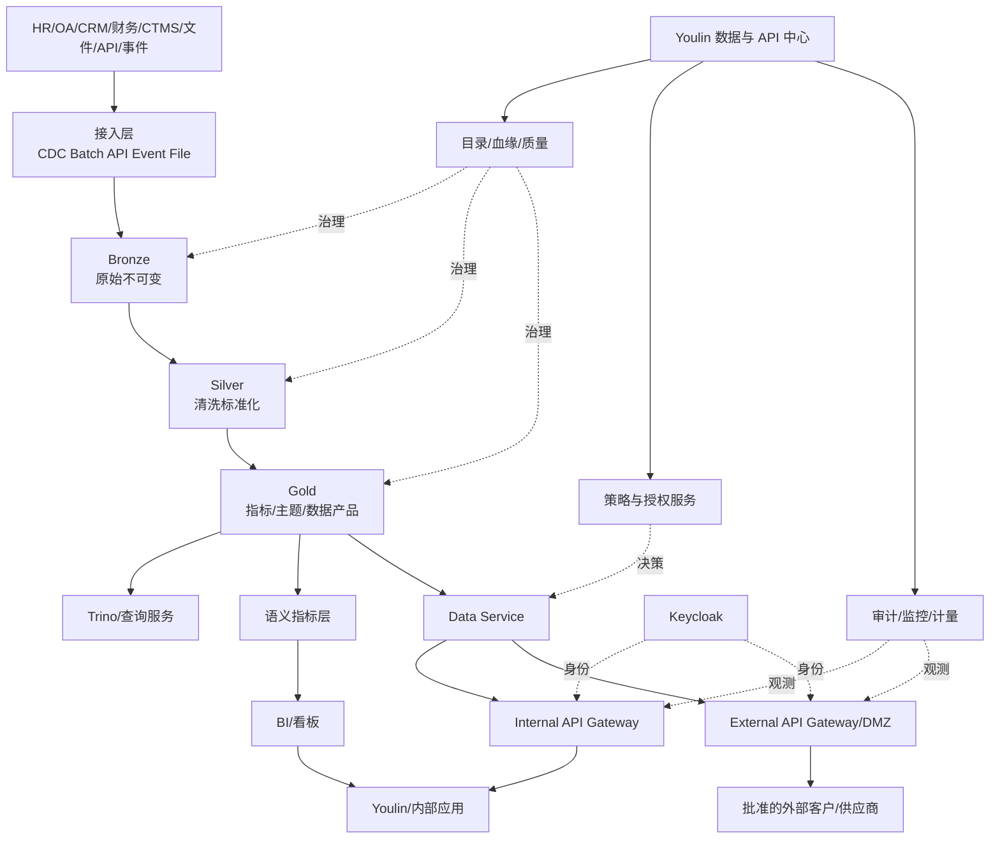

# 湖仓一体数据平台与 API 开放治理蓝图

> 状态：MVP 架构与治理基线
>
> 适用范围：Youlin 企业工作台、企业湖仓、内部应用集成及后续外部 API 服务
>
> 关联文档：[总体战略](./01-cro-ai-native-workbench-strategy.md) · [领域本体](./03-cro-domain-ontology.md) · [二开架构](./04-lobehub-extension-architecture-and-roadmap.md) · [集成契约](./06-integration-contracts.md) · [MVP PRD](./07-mvp-product-spec.md) · [交付路线](./08-delivery-roadmap.md) · [多系统融合规范](./09-multi-system-fusion-integration-standard.md)

## 1. 定位与目标

Youlin 工作台是湖仓和 API 的统一展示、申请、治理及运营控制面，不直接充当湖仓计算引擎，也不允许浏览器或 Desktop 直接连接数据库、查询引擎、消息系统或 OSS Bucket。

```text
Youlin 工作台负责：看、搜、申请、审批、发布、监控、审计
湖仓数据平台负责：采集、存储、计算、治理、质量、血缘、服务
API Gateway 负责：认证、路由、限流、网络边界和协议防护
Data Service 负责：数据契约、业务授权、行列过滤和响应组装
源业务系统负责：交易事实、正式状态和业务写回终态
```

建设目标：

1. 基于企业 OSS 建立可演进的湖仓分层和开放表格式；
2. 将 Dataset、指标、API 封装为有 Owner、有质量、有权限的数据产品；
3. 在 Youlin 中建设“数据与 API 中心”；
4. 使用 Keycloak 统一员工、内部应用和外部应用身份；
5. 通过 RBAC、ABAC、行列权限、脱敏、用途和有效期实施最小授权；
6. 为内部应用提供受控 API、事件、批量导出和指标服务；
7. 为后续对外供应商开放建立独立网关、Sandbox、合同和审计基础；
8. 确保数据访问可以追溯到来源、转换、授权、调用和交付结果。

## 2. MVP 边界

### 2.1 MVP 1 纳入

- 数据与 API 中心菜单、权限和基础管理页面；
- DataSource、Dataset、DataProduct、Metric、APIProduct、APIClient、Policy、AccessGrant 等元数据模型；
- 一个低敏内部数据源的湖仓 PoC；
- Bronze/Silver/Gold 分层和一个开放表格式验证；
- 一个低敏内部数据产品和一个只读内部 API；
- Keycloak 服务身份、OAuth Scope 和短期令牌；
- API Gateway 的认证、路由、限流、配额、版本和审计基线；
- Dataset/Data Product 的 Owner、分类、质量和基础血缘；
- 行级、列级和脱敏策略 Spike；
- API 注册、审核、发布、弃用、停用和授权回收闭环；
- 工作台中的目录浏览、权限申请、调用量和运行状态展示。

首个候选数据产品为“企业组织与部门目录”，仅暴露业务必需字段，例如 `employeeId`、`displayName`、`departmentId`、`departmentName`、`employmentStatus`；不得包含证件、薪酬和私人联系方式。

### 2.2 MVP 1 不纳入

- 全企业历史数据一次性迁移；
- 完整 MDM、实时数仓或任意 SQL 服务；
- 浏览器、Desktop 或外部应用直连数据库/Trino/OSS/Kafka；
- 受试者、人遗、PV 病例、EDC 明细和 GxP 受控记录开放；
- 对外供应商生产数据的大规模开放；
- 跨境数据调用；
- 未经批准的数据导出和匿名公网 API；
- 湖仓直接写回源系统。

“具备对外 API 能力”不等于“允许数据对外提供”。每个外部数据产品仍需单独完成业务、数据、安全、隐私、法务和必要的 QA 审批。

## 3. 总体架构



### 3.1 数据面与控制面分离

| 平面 | 核心内容 | 访问规则 |
| --- | --- | --- |
| 数据面 | OSS、Iceberg 表、查询、转换、API 响应、事件 | 只能由服务身份访问 |
| 控制面 | 目录、产品、策略、授权、Schema、质量、血缘、配额 | 由 Youlin 展示和治理 |
| 管理面 | 集群、网络、密钥、备份、发布、告警 | 仅平台运维和安全管理员 |

Youlin 保存控制面元数据和权限投影，不复制成为业务数仓，也不保存外部系统万能凭据。

## 4. 湖仓存储与数据分层

资源中心与湖仓可以使用同一企业 OSS 产品，但必须使用不同 Bucket、服务账号、KMS Key、生命周期和访问策略。

```text
资源中心：
resource-original
resource-preview
resource-artifact
resource-memory

湖仓：
lakehouse-bronze
lakehouse-silver
lakehouse-gold
lakehouse-checkpoint
lakehouse-export
```

### 4.1 分层规则

| 层级 | 目的 | 修改规则 | 对外服务 |
| --- | --- | --- | --- |
| Bronze | 保存源数据快照、CDC 和接入证据 | 追加/不可变，按保留策略管理 | 禁止 |
| Silver | 清洗、去重、标准化、身份映射 | 由版本化 Pipeline 生成 | 仅受控内部查询 |
| Gold | 业务主题、指标、数据产品输出 | 有契约、Owner 和质量门禁 | Data Service/API/BI |
| Export | 经审批的临时交付物 | 到期删除、Hash、水印和下载审计 | 仅指定接收方 |

推荐采用 Iceberg、Delta Lake 或 Hudi 等开放表格式；选型前验证 OSS 兼容、并发、Schema Evolution、Time Travel、Compaction、灾备和团队能力。当前优先验证 Apache Iceberg + Trino，但 ADR 冻结前不视为最终产品选型。

## 5. 数据与 API 中心信息架构

```text
数据与 API 中心
├── 数据源中心
├── 数据目录
├── 数据产品
├── 指标中心
├── API 中心
├── 应用与客户端
├── 权限申请与授权
├── 数据质量
├── 血缘与影响分析
├── 任务与运行监控
├── 用量、配额与成本
└── 安全审计
```

### 5.1 数据源中心

登记系统、Owner、供应商、网络区域、接入方式、同步频率、Schema、数据等级、SLA、运行状态和变更通知。Credential 只保存 Secret 引用，不在前端或普通元数据表中保存明文。

### 5.2 数据目录

展示数据域、Dataset/Table/View、字段定义、业务术语、权威来源、Owner/Steward、更新频率、血缘、质量评分、分类分级和可申请用途。

### 5.3 数据产品中心

底层表不能直接作为开放产品。数据产品至少包含：

- 稳定代码、名称、版本和业务定义；
- Owner、Data Steward 和技术负责人；
- 来源、转换、血缘和刷新频率；
- Schema、字段语义和兼容规则；
- 数据分类、允许用途和消费者范围；
- 行列权限、脱敏和聚合规则；
- 数据质量阈值和 SLA/SLO；
- API、SQL、Event 或批量交付方式；
- 保留、停用、替代和删除规则。

### 5.4 API 中心

提供 API 注册、OpenAPI 展示、版本、环境、订阅、审批、Scope、配额、客户端、调用日志、告警、弃用和停用。Developer Portal 可以独立部署，但产品与授权真相必须来自统一控制面。

## 6. 核心元数据模型

| 实体 | 用途 |
| --- | --- |
| `DataSource` | 源系统和接入配置元数据 |
| `Dataset` | 表、视图、文件集合或事件流的目录对象 |
| `DatasetVersion` | Schema、分区和快照版本 |
| `DataProduct` | 面向消费者发布的数据服务单元 |
| `DataContract` | Schema、质量、兼容性和 SLA 契约 |
| `MetricDefinition` | 指标公式、粒度、时间口径和版本 |
| `APIProduct` | API 集合及其业务边界 |
| `APIVersion` | OpenAPI 契约和生命周期状态 |
| `APIClient` | Keycloak Client 与消费应用映射 |
| `Subscription` | 应用对 API/Data Product 的订阅 |
| `Policy` | RBAC/ABAC、行列、脱敏、用途和配额规则 |
| `AccessRequest` | 权限申请及审批证据 |
| `AccessGrant` | 有范围、有用途、有期限的授权 |
| `DataQualityRule` | 完整性、唯一性、及时性和一致性规则 |
| `LineageEdge` | Source→Dataset→Metric/API 的血缘关系 |
| `DataJobRun` | 接入、转换、质量和发布运行 |
| `APIUsageRecord` | API 调用、结果数量、延迟和计量记录 |
| `DataExport` | 批量导出文件、Hash、接收方和删除状态 |

稳定 ID 不使用显示名称。数据对象删除优先进入 `deprecated/retired` 状态，不能直接破坏既有消费者。

## 7. 身份、角色与职责分离

### 7.1 身份类型

| 身份 | Keycloak 形态 | 典型用途 |
| --- | --- | --- |
| 员工 | User/Group/Role | 浏览目录、申请权限、运营管理 |
| 内部应用 | Confidential Client/Service Account | 系统间 API 调用 |
| 外部应用 | 独立 Realm 或隔离 Client | 批准后的外部 API 调用 |
| 运维自动化 | Workload Identity/短期凭证 | Pipeline、发布和巡检 |

禁止共享应用账号、共享长期 API Key 和将生产 Client Secret 下发给浏览器/Desktop。用户代理场景使用授权码和用户上下文；机器调用使用 Client Credentials，必要时叠加 mTLS。

### 7.2 平台角色

| 角色 | 职责 |
| --- | --- |
| Data Platform Admin | 平台、存储、计算和网关管理 |
| Data Owner | 决定数据允许用途和授权 |
| Data Steward | 字段、术语、分类、质量和元数据维护 |
| Data Engineer | 接入、转换和模型建设 |
| Metric Owner | 指标定义、验证和发布 |
| API Product Owner | API 契约、版本、SLA 和消费者管理 |
| API Consumer | 申请并按授权调用 API |
| Security/Privacy | 安全、隐私和对外开放评审 |
| Auditor | 只读检查授权、调用、导出和数据流 |
| External Client Admin | 管理单个外部组织的应用凭证和成员 |

开发者不得自行批准自己的外部 API，数据工程师不得自行决定敏感数据用途，消费者不得自行提高配额或数据范围。

## 8. 权限模型与执行链路

权限按以下顺序叠加：

```text
平台功能权限
→ 数据产品/API 订阅权限
→ Dataset/Table 权限
→ 行级过滤
→ 列级允许/拒绝
→ 动态脱敏
→ 用途、环境、网络和时间限制
→ 配额和并发限制
```

策略上下文至少包含：

```text
subject：用户、Client、部门、角色、法人
resource：Data Product、API、Dataset、字段、数据等级
action：discover、request、query、download、publish、admin
context：purpose、project、environment、IP、时间、审批单、合同
```

执行链路：

```text
用户/应用
→ Keycloak 认证
→ Gateway 验证 Token、Audience、Scope、mTLS/IP 和配额
→ Authorization Service 计算策略
→ Data Service 绑定 Data Product/Data Contract
→ 查询引擎执行行列过滤
→ 响应字段白名单与脱敏
→ 返回结果
→ 记录授权决策、调用量和 Trace
```

工作台是管理入口，不是唯一执行点。API Gateway、Data Service 和查询引擎必须各自实施对应层级的 PEP；策略服务作为 PDP，目录、组织和项目服务作为 PIP。

## 9. API 治理

### 9.1 生命周期

```text
draft → testing → reviewing → published → deprecated → retired
```

每个 API 必须登记 API ID、版本、Owner、Data Product、OpenAPI、数据等级、Scope、消费者、行列策略、配额、SLA、保留策略、弃用日期和替代版本。

### 9.2 发布规范

- 使用 OpenAPI 3.x 和稳定版本路径；
- 不暴露内部数据库表名和供应商 Schema；
- 不提供任意 SQL、任意字段选择或无限制全量下载；
- 查询有分页、排序白名单、超时和最大返回量；
- 写操作必须有幂等键、乐观锁、回执和风险审批；
- 破坏性变更提升主版本并提供迁移窗口；
- Error Code、Trace ID、时间格式和枚举遵循统一规范；
- Data Contract 和契约测试进入 CI/CD；
- API 只访问 Gold/Data Product，不直接读取 Bronze。

### 9.3 交付方式

| 方式 | 适用场景 | 关键控制 |
| --- | --- | --- |
| REST API | 应用实时查询 | Scope、分页、限流、字段白名单 |
| Async Job + Download | 批量交付 | 审批、Hash、水印、短时 URL、到期删除 |
| Event/Webhook | 状态变化通知 | 签名、防重放、重试、死信 |
| Kafka/Pulsar | 内部高吞吐事件 | Topic ACL、Schema Registry、消费审计 |
| SQL Endpoint | 受控内部分析 | 行列权限、查询配额、只读 |
| Metric/BI API | 看板与指标 | 指标版本、RLS、聚合保护 |

## 10. 内部与外部 API 隔离

```text
Internal Gateway                 External Gateway / DMZ
├── Youlin                       ├── 客户应用
├── 泛微/CRM/内部系统             ├── 外部供应商
└── 内部自动化                    └── 合作方
```

外部入口要求：

- 独立域名、网络区和 WAF；
- OAuth2 Client Credentials，推荐 mTLS；
- 每个客户、供应商和环境独立 Client；
- 固定 IP/网络策略、短期 Secret 和轮换；
- 独立字段白名单、行范围、配额和有效期；
- Sandbox 使用合成或脱敏测试数据；
- 合同、目的、接收方和数据处理边界绑定授权；
- 异常检测、紧急停用和凭证吊销；
- 不允许访问 Trino、PostgreSQL、OSS Bucket、内部消息系统和 Bronze/Silver。

当前“数据不出境、不越出批准处理边界”继续作为硬约束。境外主体、境外网络、跨境云服务或跨境支持人员访问默认拒绝，除非后续通过独立法律与安全决策改变边界。

## 11. API 授权与撤销流程

```text
注册应用
→ 选择 Data Product/API
→ 申明用途、字段、范围、频率、环境和有效期
→ Data Owner 审批
→ Security/Privacy 条件审批
→ 必要时 QA/法务审批
→ 创建 Keycloak Client 和 Scope
→ 配置 Gateway、配额、mTLS/IP 和策略
→ Sandbox 契约测试
→ 生产发布
→ 持续监控和定期复核
→ 到期自动回收/主动吊销
```

授权必须回答：谁、通过哪个应用、为了什么目的、访问什么数据、允许哪些字段/记录、从何处访问、持续多久、调用多少以及由谁批准。

## 12. 数据质量、血缘与变更

每个生产数据产品至少设置：

- 完整性、唯一性、及时性、一致性和范围规则；
- 质量阈值、阻断级别和 Owner；
- Source→Bronze→Silver→Gold→Metric/API 的字段级或表级血缘；
- Schema 兼容策略；
- 上游变化影响分析；
- 重算、回滚、补数和消费者通知；
- API 契约测试和历史版本兼容测试。

质量不达标时不得静默发布。根据规则选择阻断、降级、标记陈旧或返回不可用状态。

## 13. 审计、监控与计量

每次访问至少记录：

- 用户 `sub` 或 `clientId`；
- Data Product、API、版本和 Scope；
- 请求字段、行范围和用途；
- 策略及授权版本、审批单和脱敏策略；
- 返回记录数/字节数、状态、延迟和成本；
- 来源 IP、网络区、时间和 Trace ID；
- 导出文件 Hash、接收方、下载和销毁状态。

不得把完整敏感响应写入普通日志。安全审计、API Access Log、业务记录和调试日志分开保留和授权。

运营看板至少覆盖可用性、错误率、P95 延迟、调用量、拒绝率、配额、陈旧数据、质量失败、热点消费者、成本和即将到期授权。

## 14. 技术组件参考

| 能力 | 候选方案 | 说明 |
| --- | --- | --- |
| 对象存储 | 企业 OSS/S3 兼容存储 | 与资源中心逻辑/物理隔离 |
| 表格式 | Iceberg 优先验证；Delta/Hudi 备选 | ADR 后冻结 |
| 查询 | Trino | 交互分析和服务查询，不直接外放 |
| 批流处理 | Spark/Flink | 按场景选择，不要求 MVP 同时建设 |
| 转换 | dbt 或版本化 SQL/Pipeline | 进入 Git 和 CI |
| 调度 | Airflow/DolphinScheduler | 结合现有运维能力 |
| 目录血缘 | OpenMetadata/DataHub | 二选一验证 |
| 数据质量 | Great Expectations/Soda/自研规则 | 与发布门禁联动 |
| API Gateway | Apache APISIX/Kong/企业现有网关 | 内外网分区 |
| 策略 | OPA/独立 Authorization Service | 应用和 API 策略 |
| 表权限 | Ranger/Trino 权限插件 | 验证行列权限能力 |
| 事件 | Kafka/Pulsar | MVP 非必需 |

不建议一次引入所有组件。Spike 必须验证性能、HA、备份、权限、可观测、国内部署和团队运维成本。

## 15. MVP 验收标准

1. 工作台能发现一个低敏 Data Product，并显示 Owner、Schema、分类、质量、血缘和 SLA；
2. 员工可提交权限申请，经审批形成有范围和期限的 AccessGrant；
3. 一个内部应用通过独立 Keycloak Client 调用只读 API；
4. Gateway 拒绝无 Token、错误 Audience、错误 Scope、过期授权和超配额请求；
5. Data Service 验证字段白名单、行级过滤和至少一种动态脱敏；
6. API 响应可追溯到 Gold Dataset、转换版本和源系统；
7. Schema 破坏性变更被契约测试或发布门禁阻断；
8. 到期授权和吊销凭证在目标 SLA 内停止访问；
9. 浏览器/Desktop 无法获得数据库、OSS、Trino 或生产 Client Secret；
10. API 调用、权限决策、导出和管理员操作均有 Trace 和审计记录；
11. 外部 Gateway 只使用合成/批准的低敏数据进行技术验证；
12. 受试者、人遗、PV、GxP 和跨境数据未进入 MVP 数据产品。

## 16. 分阶段建设

### 阶段 A：MVP 控制面与 PoC

- 数据/API 元数据模型和页面；
- OSS 湖仓分区、一个数据源和 Bronze/Silver/Gold；
- 一个 Data Product、一个内部只读 API；
- Keycloak Client、Gateway、授权、审计和质量基线。

### 阶段 B：企业数据产品

- CRM、财务、项目与经营主题；
- 指标中心、语义层和 BI；
- 完整血缘、质量门禁、调度和成本治理；
- 内部事件和批量交付。

### 阶段 C：外部 API

- External Gateway/DMZ 和 Developer Portal；
- Sandbox、mTLS、合同、计量和消费者运营；
- 经批准的外部 Data Product；
- 定期复核、撤销、应急和合规审计。

阶段 C 必须作为独立 Go/No-Go，不因阶段 A/B 技术完成而自动开放。

## 17. 待冻结决策

1. 企业 OSS 产品、地域、Bucket/KMS 和备份；
2. Iceberg、Delta Lake 或 Hudi；
3. Trino 与处理引擎部署方式；
4. OpenMetadata 或 DataHub；
5. 调度、转换和质量工具；
6. API Gateway 及内外网隔离拓扑；
7. Authorization Service 与表级权限实现；
8. 数据分类分级、脱敏和用途字典；
9. 首个 Data Product、源系统和 Owner；
10. 外部 API 允许的数据边界和审批矩阵；
11. 数据保留、归档、删除和 Legal Hold；
12. API 计量是否仅用于配额，还是进入后续商业计费。
