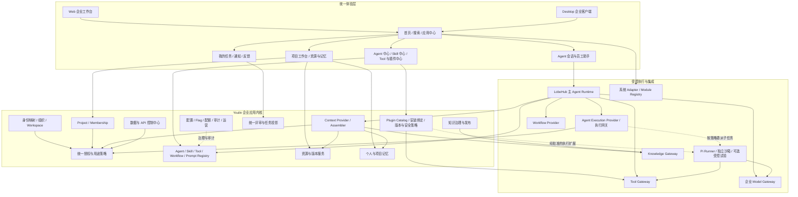
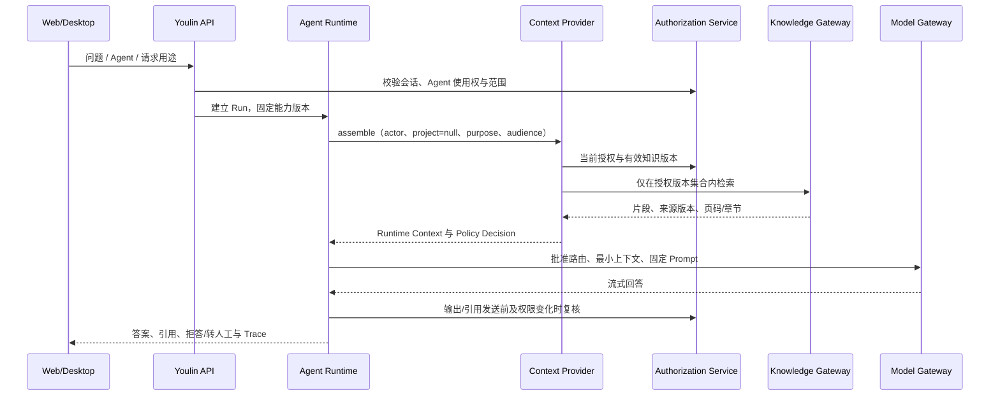
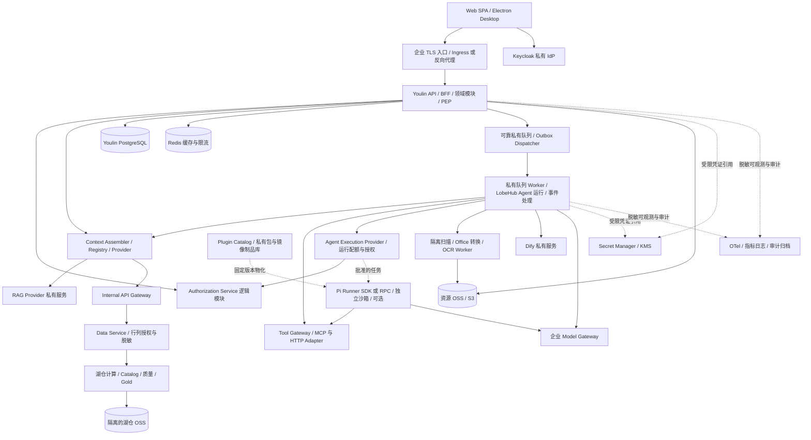

# Youlin 企业 AI 工作台应用架构与技术架构

> 状态：架构设计基线 1.1，已显式补齐 Agent/Skill/Tool、应用中心、插件治理与 Pi 执行后端；供评审使用，不代表已经部署或验收。
>
> 范围：MVP 1（Stage 0）及后续演进边界。
>
> 依据：01～12、MVP PRD 2.4、开发计划 1.6；统一口径以 [plan/04](./plan/04-unified-baseline-and-decision-register.md) 为准。
>
> 编号说明：13～17 保留给安全、部署、数据模型、验证和临床场景专题，本文件采用 18。

## 1. 架构摘要

Youlin 基于 LobeHub 建设企业统一 AI 工作入口，组合身份、项目、资源、知识、记忆、Agent、数据服务和治理能力，不替代源业务系统。

**应用架构**回答：有哪些业务模块、服务哪些用户、谁拥有业务事实、模块如何协作。

**技术架构**回答：模块如何实现和部署、使用哪些组件、数据如何存储、权限在哪里执行、如何发布和恢复。

核心设计选择：

1. Web/Desktop 共用企业服务端、账号、权限与数据。
2. Keycloak 私有部署；新人新事负责员工号和在职状态；部门/岗位唯一真源待核验。
3. MVP 采用模块化单体业务内核、独立异步 Worker 与隔离的外部执行平台，不为每个逻辑模块创建微服务。
4. Project 是经营、交付与矩阵权限单元；MVP 一个 Enterprise 映射一个主 Workspace，但两者不是同一概念。
5. 资源中心拥有文件版本和生命周期，知识发布管理 RAG 可用版本，Context Provider 按当前授权动态装配上下文。
6. Agent 不获得超出用户或受限 Workload Grant 的权限；模型不负责做授权决定。
7. Youlin 是数据/API 控制面；湖仓、Data Service 和 Gateway 承担数据面及强制访问控制。
8. 企业数据不出境、不越出批准处理边界；未知模型路由、遥测和外部依赖默认不开放。

## 2. 范围与设计状态

### 2.1 MVP 必需与后置能力

| 范围 | MVP 1 | 后续阶段 |
| --- | --- | --- |
| 用户与入口 | 两个 Pilot 部门、20～50 人，Web/Desktop；面向 300～500 人容量设计 | 企业采用、移动入口、客户工作台 |
| 身份与权限 | SSO、企业微信、组织、Project/Membership、RBAC/ABAC/ACL | Study/Country/Site 与客户隔离 |
| AI | 员工助手、2～3 Agent、3～5 Skill、至少一个只读 Tool 和低风险 Workflow | PM/报价/报销、Clinical Copilot |
| 资源与知识 | 四级资源库、文件生命周期、非 GxP 知识、个人/项目记忆 | 深度知识运营、经批准临床知识 |
| 数据服务 | 一个低敏源、Data Product、内部只读 API、独立 Client | 指标语义层、企业数据产品、外部产品 |
| 集成 | 应用目录、SSO 深链接、CRM 嵌入/Launch Code Spike | 更多业务模块与受控写回 |
| 运营 | 首页、搜索、任务、通知、评审、反馈、审计、恢复 | 企业 SLO、商业 SLA、计量 |

MVP 排除受试者数据（含去标识化记录）、人遗、PV 病例、高敏临床数据、GxP/Part 11 受控记录、匿名分享、任何外部消费者生产数据开放、全量历史迁移和 Office 多人实时编辑。

### 2.2 状态标记

- **已确定边界**：身份框架、系统职责、数据范围、授权原则及 MVP 能力边界。
- **仓库基础**：LobeHub 已有代码结构或 Provider，可评估复用，不代表企业闭环已实现。
- **待验证选型**：OSS、RAG Provider、队列、预览、湖仓、Gateway、策略引擎与部署规格。
- **后置**：临床受控、外部生产 API、完整图谱和复杂商业化。

架构图中实线表示 MVP 目标调用关系，不表示已部署；后续能力用虚线或文字标明。

# 第一部分：应用架构

## 3. 用户与应用入口

| 用户 | 主要入口 | 主要任务 | 权限边界 |
| --- | --- | --- | --- |
| 员工 | 首页、员工助手、我的工作 | 查询制度、使用 Agent、管理资源/记忆/产出物 | 本人与明确获授权资源 |
| 项目成员 | 我的项目、项目上下文 | 读取共享资料、任务、本人项目记忆 | 当前 Membership、Facet、Purpose |
| PM/Project Owner | 项目工作台 | 共享上下文、成员状态、风险与 Promotion 评审 | 不读取成员私有记忆 |
| 管理层 | 项目组合摘要 | 授权摘要和下钻 | 不因职级获得所有项目内容 |
| 内容/能力/Data Owner | 治理与评审中心 | 审核、发布、授权、质量和版本 | 按领域职责，执行职责分离 |
| 平台管理员/SRE | 管理与运营中心 | 配置、队列、容量、告警与恢复 | 技术管理不默认授予业务内容读取权 |
| Auditor | 审计入口 | 查看决定、变更、运行和访问证据 | 审计权限不自动等于原文权限 |

## 4. 应用架构总览



此图按业务能力划分；Policy、Registry、Resource、Memory 等可作为同一服务端进程内的模块。治理连线不代表运营账号可以读取全部业务数据。

## 5. 应用模块与职责

| 应用域 | 核心能力 | 拥有的业务对象 | 主要依赖 |
| --- | --- | --- | --- |
| 身份组织 | 唯一账号映射、HR 同步、组织差异、冲突裁决 | IdentityLink、组织投影、WorkspaceMember | Keycloak、HR/组织源 |
| Project | 项目资料、成员、角色、有效期、关闭归档 | Project、Membership、项目角色 | 组织、授权、项目权威源 |
| 权限治理 | RBAC、ABAC、关系、ACL、Purpose/Audience、解释与撤销 | Policy、Grant、PolicyDecision | 身份、Membership、资源策略 |
| AI 工厂 | Agent/Skill/Tool/Workflow/模型中心，版本、审核、发布、停用、评测、配额 | Agent/Skill/Tool/Workflow/Prompt 定义与版本 | Review、模型与执行 Provider |
| 插件治理 | 发现、准入、版本依赖、安装绑定、权限申请、凭证绑定、健康/停用 | PluginPackage/Version、Installation/Binding（建议模型） | Registry、私有制品库、Tool/执行 Provider；不运行任意代码 |
| 会话与运行 | 会话管理、流式、中止/重试、工具状态、引用 | Conversation、AgentRun、RunEvent | Agent Runtime、Context、资源 |
| 资源中心 | 个人/团队/企业/项目库、上传、预览、分享、版本、回收站 | ResourceLibrary、ResourceObject/Version、ShareGrant | OSS、授权、扫描/转换 Worker |
| 知识中心 | 版本选取、审核、摄取、评测、发布、撤回 | KnowledgeRelease、Provider 映射、引用清单 | 资源、RAG Provider、Review |
| 记忆治理 | 通用/项目私有/共享记忆、用户开关、Promotion | PersonalMemory、ProjectMemory、PromotionRequest | 来源授权、OSS、Review |
| Context | 授权检索、角色视图、运行上下文、失效 | ContextDefinition、RuntimeContextPackage、节点/关系投影 | PDP、Knowledge、Memory、Data Service |
| 工作中心 | 任务聚合、通知、评审入口、反馈/工单 | TaskProjection、Notification、ReviewRequest、Feedback | 领域事件、源系统、渠道 Adapter |
| 数据/API 中心 | 目录、产品、Schema、质量/血缘、权限申请和用量 | 产品/客户端/授权控制面元数据 | Catalog、Data Service、Gateway |
| 应用集成 | 模块目录、Manifest、启动、深链接、嵌入容器 | ModuleManifest、LaunchSession、外部对象映射 | Keycloak、CRM/OA Adapter |
| 平台运营 | Feature Flag、企业配置、预算、失败任务、监控与审计 | ConfigVersion、Usage、AuditEvent | Secret Manager、OTel、队列 |

### 5.1 业务所有权规则

- 每个聚合只有一个写入 Owner；其他模块通过领域接口调用，不绕过接口修改其表。
- 统一评审中心拥有通用评审外壳；对象的发布/授权规则仍由对应领域服务执行。
- 源系统任务状态与平台投影分开保存；投影不得成为正式 OA 终态。
- Project 客户/合同信息保留来源引用；MVP 不在工作台重建完整 CRM/合同系统。
- 领域边界不强制物理微服务；模块内事务可本地完成，跨平台通过 Outbox、回执和对账协调。

### 5.2 各类“中心”分别放在哪里

```text
企业工作台
├── 应用中心：CRM、泛微、项目业务模块等“有界面、有业务”的入口
├── AI 能力中心
│   ├── Agent 中心：选择/创建/发布员工助手、项目助手等角色化能力
│   ├── Skill 中心：说明、规则、步骤、示例和经批准附属文件
│   ├── Tool 中心：可调用动作、Schema、风险、审批和执行记录
│   ├── Workflow 中心：固定流程版本、输入输出、运行和恢复
│   └── 模型与 Prompt 中心：批准路由、模板、评测、预算
└── 插件与连接器中心：为上述能力安装/绑定/升级受控扩展
    ├── MCP/HTTP 连接器
    ├── Skill/Prompt/Agent 模板包
    ├── Pi Extension/Package 等执行扩展（隔离运行，默认关闭）
    └── UI 扩展或外部模块集成包（经独立兼容/安全验证）
```

“中心”是产品入口，不等于新建一个独立服务。普通员工看到获授权目录与使用入口；Creator、Reviewer、平台管理员看到对应的管理视图。插件中心复用 Registry、Review、Credential、Module 和审计，不再创建一套账号、授权或 Agent 数据库。

### 5.3 Agent、Skill、Tool、Workflow 与 Plugin 的关系

| 对象 | 产品/控制面 | 运行位置 | 不应混淆 |
| --- | --- | --- | --- |
| Agent | Agent 中心、AgentDefinition/Version | 默认 LobeHub Runtime；特定任务可由受控后端执行 | Agent 定义不等于 Pi 进程或一个聊天页面 |
| Skill | Skill 中心、SkillVersion、允许运行时/依赖 | 经批准内容按需加载到 LobeHub/Pi Context | Skill 是指令和资料包，不是授权；附属脚本也须执行审批 |
| Tool | Tool Registry、Schema、CredentialBinding、ApprovalPolicy | Tool Gateway 后的 MCP/HTTP/内置 Adapter，或 Pi 沙箱内受限文件工具 | MCP 是协议，MCP Server 可提供多个 Tool；不自动获得用户权限 |
| Workflow | Workflow Registry、版本、I/O Schema | Dify 等固定编排 Provider | 不等于开放式 Agent 循环或正式 OA 流程 |
| Plugin | 受治理分发包及安装绑定，包含一种或多种扩展资源 | 取决于类型；代码扩展只在批准执行域加载 | 安装包不等于业务权限、Tool、Agent 或独立应用 |
| App/Module | 应用中心、Module Manifest、SSO Client | 独立业务应用或内建模块 | 有 UI 的应用不应强行包装成 Tool；可另暴露受控 API |
| Pi Agent | 运行时后端登记、版本、策略与部署镜像 | 独立 Pi Runner 进程/容器，SDK 或 RPC 适配 | 不是第二套员工门户、权限中心或长期记忆真源 |

关系是 `AgentVersion → SkillVersions / ToolVersions / WorkflowVersions / ContextPolicy / ExecutionProfile`；PluginPackage 可发布这些资产的定义或连接器，但每种资产仍有稳定 ID、确定版本和独立授权。跨 Runtime 的 Skill/Tool 名称、参数和能力需适配与契约测试，不能假设同一包在所有运行时直接兼容。

### 5.4 插件中心的最小治理模型

建议增加轻量 `PluginPackage/PluginVersion` 与 `Installation/Binding` 元数据，或在现有 Registry 上扩展等价对象，不要求单独插件平台：

- 包：稳定 ID、Owner、来源、精确版本/Digest、类型、Manifest、签名/完整性证据、依赖、兼容 Runtime、变更记录。
- 请求能力：Tool 清单、文件/网络/模型访问、允许数据级别、运行风险；Manifest 只是申请，不能自行授权。
- 安装绑定：Workspace/Project 范围、环境、版本、启用状态、策略引用、Secret 引用、审批与操作者。
- 依赖检查：区分内容包与可执行扩展，锁定传递依赖；相同 Tool 名冲突不能静默覆盖；升级引起权限变化须重审。
- 生命周期：包准入与安装绑定分开；已 published 包只有在获批准绑定、当前业务权限和 Flag 均允许时才可使用。
- 升级/停用：先 Test 兼容/安全评测，再灰度与回滚；停用阻止新加载和新调用，并处理运行中任务，保留历史版本与审计。
- 私有制品库：内容/模板、扩展包、依赖与 Runner 镜像分别按类型管理；构建阶段扫描，生产不现场拉取 npm/Git 最新版本或执行任意安装脚本。

权限计算增加插件安装策略上限：`用户/Agent/Project 权限 ∩ Tool/数据策略 ∩ Plugin Binding ∩ 运行时沙箱策略`。个人安装不能把企业资源变成可外发数据；浏览器不获得连接器 Secret。

### 5.5 Pi 的业务角色与阶段边界

Pi 用于需代码、脚本、文件批处理或工程自动化的受限任务，例如在合成/批准低敏材料上生成文件、检查代码或执行数据转换。默认对话、员工助手与企业 Agent 编排仍由 LobeHub 提供，固定 AI 流程仍由 Dify 提供。

MVP 必需的是 Runtime/Tool 适配边界和治理模型；Pi 仅为默认关闭的受控技术试验，不新增生产 Shell、Git 推送或临床数据执行承诺。完整 Pi 执行服务、任意插件安装、公开 Marketplace、插件计费和多客户生态均需单独范围/容量批准。既有 22～26 周排期不因本次补图自动覆盖这些新增深度能力。

### 5.6 应用中心与插件中心的交互

应用中心负责“打开业务系统”；插件中心负责“为用户/Agent/应用配置受控能力”。例如 CRM 应用可独立 SSO 打开，同时安装 CRM 只读连接器，把批准 API 注册成 Tool；员工可以有 CRM 打开权而没有某个 Tool 权，反之亦须由业务策略明确批准，不能互相自动继承。

## 6. 外部系统与权威事实

| 系统 | 主责 | Youlin 接入方式 | 不允许的替代关系 |
| --- | --- | --- | --- |
| 新人新事 | 员工号、在职状态 | 同步 Adapter，全量/增量/对账 | Keycloak/湖仓不能成为人事真源 |
| Keycloak | 认证、MFA、Session、Client、身份 Broker | Generic OIDC、Admin API | Token Role 不替代业务对象授权 |
| 企业微信 | 登录与通知渠道 | 独立 Adapter 或 Keycloak SPI，通知 Adapter | 不在 Youlin 创建第二套身份逻辑 |
| 泛微 | 正式审批及业务流程终态 | SSO 深链接，批准的只读待办引用 | Review/通知不等于正式审批 |
| 自研 CRM | 客户、机会等经营事实 | 首个 SSO/Embedded/API 验证对象 | 工作台不复制全部 CRM 表 |
| 用友 | 财务事实 | 首期登记/深链接，后续批准的数据产品 | AI 不自动形成财务终态 |
| RAGFlow/原生 RAG | 文档解析、索引和检索 | Knowledge Provider | 不拥有资源原件与发布授权真相 |
| Dify | 固定 AI Workflow 的节点执行 | Workflow Provider | 不承担正式长事务审批终态 |
| Pi Agent / Pi Runner | 代码、文件与脚本任务的可选执行后端 | Agent Execution Provider / 受控任务 Tool | 不在 Web/API 进程运行，不拥有独立企业授权/记忆真源 |
| 私有插件/制品目录 | 扩展包、模板与连接器版本分发 | Plugin Catalog 与受控发布流水线 | 不直接从公共市场自动安装生产代码 |
| 企业 Model Gateway | 批准模型路由、限流、预算和数据策略 | Model Runtime/Provider | 不替代来源权限判断 |
| 湖仓/Catalog | 分层数据、质量、血缘、产品数据 | Catalog/Data Service Adapter | Youlin 不直接成为查询计算引擎 |
| CTMS/EDC/eTMF/IWRS/QMS/PV | 临床/受控业务事实 | MVP 仅盘点，不摄取受控业务内容 | 后续逐场景批准，不默认开放 |

## 7. 关键应用协作流程

### 7.1 员工工作助手



若使用 Dify 问答 Workflow，其检索节点仍调用 Knowledge Gateway/Context 接口，不允许 Dify 持有绕过用户权限的全库检索密钥。制度事实按有效正式来源回答，无依据、冲突、过期或越权时拒答/转人工。

### 7.2 文件到知识

```text
创建上传会话 → 配额/类型/范围检查 → 隔离区上传
→ 实际大小/Hash/MIME 校验 → 恶意扫描 → 不可变 ResourceVersion
→ 预览与资源搜索投影
→ Owner 选择确定版本 → Review 批准 → publishing
→ RAG 摄取/质量评测 → 原子激活 KnowledgeRelease
→ 授权检索与引用
```

普通上传不自动进入 RAG；资源全文搜索与知识检索均须预过滤 ACL。摄取失败保留原有效发布，不开放半完成索引。

### 7.3 个人记忆到项目共享记忆

```text
个人项目记忆 → 本人选择内容并提交脱敏草稿
→ 来源/用途/分类检查 → 指定 Reviewer 审核
→ 新建 ProjectMemory → 按项目 Facet 进入 Context
```

Promotion 不改变原私有记录的所有者。Reviewer 只能看已提交草稿，不获得原个人记忆的完整读取权。共享记忆不是源系统正式决定。

### 7.4 内部数据 API

```text
应用注册 → Data Product 发现与权限申请 → Owner 审批
→ AccessGrant/Client/Scope 配置 → 契约测试
→ 内部应用携带 Token → Internal Gateway
→ PDP → Data Service → Gold/查询引擎行列策略
→ 字段白名单/脱敏 → 响应、用量、Trace 与授权审计
```

目录发现权不等于查询权；湖仓组织目录不能用于实时禁用判断。AI 使用数据服务还须经过 Context Provider，并绑定用户或受限 Workload Grant。

### 7.5 撤权与离项

```text
HR/Project/资源授权变更
→ 权威撤销状态与策略版本持久化
→ PEP 拒绝新访问/Tool/输出提交
→ Outbox 事件
→ Session/任务/Context Cache/搜索/向量/关系投影更新
→ 各消费者回执、失败重放与对账
```

即时访问阻断和异步投影清理是两层控制；不能等向量删除完成才撤权。单人离项不删除其他合法成员共享使用的项目索引。历史会话、标题、引用、导出和缓存也不能成为旁路。

# 第二部分：技术架构

## 8. 技术分层总览



图中 CLIENT→KC 为登录流程，Web OIDC 回调/换票由应用认证组件按 Client 类型完成；Desktop 为公共客户端，不配置共享 Client Secret。CTX→IGW 为运行时数据消费路径；控制面治理通过受控管理 Adapter 访问 Catalog/Gateway，不在 API 进程执行任意湖仓 SQL。

## 9. 技术组件与选型状态

| 层级 | 技术/组件 | 状态与实施要求 |
| --- | --- | --- |
| Web | Next.js、React、React Router SPA、TypeScript | 仓库基础；业务 UI 放 features，路由保持薄层 |
| UI/状态 | Lobe UI、Ant Design、antd-style、Zustand、SWR | 复用现有约定，避免第二套状态/设计体系 |
| Desktop | Electron、系统浏览器 SSO、系统安全凭据存储 | 同一企业后端；OS/签名/更新策略按 D11 冻结 |
| 服务端 | Node.js、TypeScript、Hono、tRPC | 复用 apps/server 服务层；跨系统 REST/OpenAPI |
| 认证 | Better Auth/Generic OIDC 接 Keycloak | Keycloak 已选；Adapter/SPI 按 D02 验证 |
| 元数据 | PostgreSQL、Drizzle ORM | 明确表约束、索引、范围和迁移；RLS 为待评估纵深防御 |
| 缓存 | Redis | 不作为权限真源；缓存必须绑定授权版本 |
| 队列 | 私有可靠任务队列 + Outbox/Inbox | D07 选型；不可假设公网 QStash 已获准或可用 |
| 文件 | 企业 OSS/S3 兼容存储 | D04 选型，Bucket/账号/KMS/保留隔离 |
| 文件处理 | 扫描、Office/PDF 转换、OCR/转码组件 | D04 Spike；进程/容器沙箱、资源限制、默认无出站 |
| RAG | Knowledge Provider；RAGFlow 或原生实现 | 每 KB 唯一在线 Provider；D05 验证文档级 ACL 预过滤 |
| Agent | agent-runtime、context-engine、tool-runtime | 默认 LobeHub 主运行时；补 Agent/Skill/Tool Registry、授权、失效与审计接点 |
| Pi 执行后端 | Pi coding-agent SDK 或 RPC，经独立 PiExecutionProvider 适配 | 可选受控 Spike；不是 Web 内嵌 Shell，不默认开放生产执行 |
| 插件/连接器 | Plugin Catalog、Installation/Binding、私有制品库 | MVP 复用 Registry 的受控目录/绑定；任意代码热装、公开市场与计费后置 |
| 模型 | model-runtime + 企业 Model Gateway | 现有网关优先；D06 核验实际处理区域和路由 |
| Workflow | Dify Provider | D05 验证版本固定、取消/状态与恢复能力 |
| 策略 | 统一 Authorization Service，OPA 或自研 PDP 候选 | 不强制引入新引擎；D10 证明 PEP 覆盖与撤销语义 |
| 数据平台 | Iceberg/Delta/Hudi、Trino 或等价引擎 | D08 选型；只验证一个低敏产品，不全栈铺开 |
| Catalog/质量 | OpenMetadata/DataHub、规则引擎或等价方案 | 候选，避免重复建设和双目录真源 |
| Gateway | 企业现有网关/APISIX/Kong 等候选 | D08 核验 OIDC、Scope、配额、审计和网络隔离 |
| 可观测 | OpenTelemetry，Prometheus/Grafana 等候选 | 指标日志可采样，关键审计不可采样丢失 |
| 交付 | pnpm 管依赖、bun 执行脚本，现有 CI/CD 或 Harness | 工具版本跟随仓库；Harness 非采购前置 |

开源版 Workspace/RBAC 存在占位实现，尤其 `withRbacPermission` 不能作为安全边界。必须审计全部 API、Worker、搜索和 Tool 路径，不得仅复用表结构或隐藏菜单。

## 10. 部署单元与网络边界

### 10.1 MVP 部署单元

| 单元 | 推荐边界 | 扩展方式 |
| --- | --- | --- |
| Web/认证壳/API | 初期可合并部署，保持现有启动方式 | 根据连接数、流式和负载再拆 API |
| 企业领域内核 | 模块化单体，内部接口与写入 Owner 清晰 | 单域有独立扩容/发布需求时再拆服务 |
| Agent/异步 Worker | 与 Web 请求进程分开，按任务类型分队列 | 并发、时间、Token、预算与租户配额 |
| 扫描/转换 Worker | 与普通业务 Worker 隔离的沙箱 | 格式队列、CPU/内存/输出限制 |
| Pi Runner（可选） | 独立任务进程/容器或更强沙箱，与 Web、文件转换和其他用户隔离 | 单 Run 工作目录、限时 Grant、出站/资源配额；SDK/RPC 本身不是安全沙箱 |
| Keycloak | 独立身份服务及数据库/账号 | HA 和备份拓扑按风险与 D14 确认 |
| Dify/RAG | 独立平台及自身数据库/索引/服务账号 | 解析与检索、运行任务分别扩容 |
| Data Service/Gateway/湖仓 | 独立数据访问与计算边界 | 先最小 PoC，再按质量/容量扩展 |
| 可售业务模块 | 独立 Client、配置、构建与数据边界 | Standalone + Embedded；核心业务不依赖 Hub 在线 |

平台内建首页、权限和搜索不要求单独可售或逐一部署；可售业务模块才适用完整独立运行要求。

### 10.2 网络与凭证

```text
员工终端
  → 企业批准访问入口 / TLS
    → Web/API 区
      → 领域服务 / Worker 区
        → 数据库、资源 OSS、队列、缓存区
        → 隔离文件处理区
        → Dify/RAG/模型网关执行区
        → 内部 Gateway / Data Service / 湖仓区

管理通道 → 管理入口 / MFA / 受限运维身份
服务出口 → 白名单 / 代理或网关 / 数据策略 / 审计
后续外部消费 → 独立 DMZ/External Gateway（MVP 不开生产流量）
```

- Dev/Test/UAT/Pilot-Prod 的 Client、Secret、数据库、Bucket、域名和审计隔离。
- 服务间使用可验证身份和最小 Scope，mTLS/工作负载身份按拓扑落地。
- PostgreSQL、Redis、湖仓、查询引擎与管理 API 不向员工浏览器/Desktop 直接开放。
- 资源隔离区允许签名上传是明确例外；该权限不扩展为 Bucket 枚举、正式区写入或湖仓访问。
- 禁止企业数据经过公共 Debug Proxy、未批准 Acceptance/遥测、日志 SaaS、插件市场或跨境支持链。
- 生产拓扑采用 Kubernetes 或受控容器平台，由 SRE 能力和压测冻结；不将示意图解释为已采购 HA 集群。

## 11. 数据与存储架构

### 11.1 存储分工

| 存储 | 保存内容 | 权威性与约束 |
| --- | --- | --- |
| Youlin PostgreSQL | 账号映射、Project/Membership、ACL、Registry、资源版本元数据、记忆元数据、任务、Review、Grant、Run/Context 引用 | 平台控制面与领域记录；不存大文件正文或全量业务数仓 |
| 私有制品库 | Skill/Prompt 内容包、插件包/依赖、Runner 镜像与 Digest | 版本不可静默覆盖；与用户上传区隔离，不让上传文件变成可执行插件 |
| 资源 OSS | 不可变原件/版本、预览、记忆载荷、产出物、导出包 | 文件载荷真源；分区、KMS、保留和访问代理 |
| RAG/Search 索引 | Chunk、向量、全文、搜索摘要、节点/关系投影 | 可重建派生物；带来源版本、Scope 和策略信息 |
| Redis | 会话辅助、短期缓存、限流、授权版本投影 | 不承担唯一持久业务事实；失效不能突破授权 |
| 队列与 Outbox | 待执行任务、事件、重试与回执 | 至少一次投递，业务副作用幂等 |
| 湖仓 OSS | Bronze/Silver/Gold、Checkpoint、受控 Export | 与资源中心隔离 Bucket、账号、KMS 和生命周期 |
| 审计归档 | 关键操作、授权/评审证据、完整性校验 | 独立权限、追加写、受控保留与导出 |

不能把所有类型放入一个无约束 JSON/memory 表，也不能让 RAG 索引成为资源版本和发布状态的权威源。

### 11.2 文件安全访问与生命周期

资源对象采用不透明 ID/Key，避免姓名、原文件名和业务语义出现在 Key；预览/下载通过实时鉴权网关或流式代理。每次 Range、新请求和引用打开均复核状态与权限。

普通 OSS 预签名 URL 是到期前可用的持有者凭证，不能靠取消 ShareGrant 即时撤销。MVP 普通预签名用于隔离上传和批准服务间传输；例外须 ADR 明确残留窗口并修改验收。

删除先进入逻辑不可访问状态，再执行回收站、Hold、保留和物理销毁。备份恢复后先重放撤权/删除账本，再开放服务。已下载、截图和已显示内容无法远程收回。

### 11.3 一致性与迁移

- 数据库状态与 Outbox 同事务提交；跨 OSS、索引、Dify 与源系统使用幂等任务、补偿和对账。
- 发布/审批绑定确定对象版本和 Hash；改动对象需重新审核；并发使用 expectedVersion/If-Match。
- 上传 complete、事件消费、通知和外部写操作有独立幂等键与唯一约束。
- 超时但结果未知时查询源回执，不盲目重试有副作用动作。
- 迁移使用 expand→migrate→contract；破坏性收缩独立发布，无法安全降级时前向修复。
- 来源版本、业务有效时间与 observed/recordedAt 分开记录；恢复依赖数据库、原件和 KMS，不能只备份向量。

## 12. 授权与 Context 技术架构

### 12.1 PDP、PIP 与 PEP

| 角色 | 职责 | 典型位置 |
| --- | --- | --- |
| PIP | 提供当前身份、组织、成员、资源和授权属性 | HR/Project 投影、ACL、Grant、来源状态 |
| PDP | 按版本化策略计算允许/拒绝与限制条件 | Authorization Service 逻辑模块 |
| PEP | 在访问发生处执行结论 | API、资源代理、检索、Worker、Tool、Data Service、输出提交 |

权限模型：

```text
用户触发 Agent 的有效权限
= 用户当前权限
∩ Agent Manifest 能力范围
∩ 当前 Project Membership（非项目场景不适用）
∩ 资源/数据权限
∩ Tool 权限
∩ Purpose / Audience
∩ 环境 / 时间 / Entitlement / Feature Flag
```

后台 Agent 使用独立 Workload Identity 与限时、有 Owner、有用途的 Grant，不使用万能服务账号。

### 12.2 Context Provider

接口固定为 `assemble`、`preview`、`explain`、`invalidate`，内部按如下阶段执行：

1. 从认证上下文派生 actor、serviceIdentity、workspace，校验请求 Purpose/Audience/Project。
2. 计算当前权限和可访问来源集合；员工助手可显式 project=null。
3. 在授权集合内检索资源、知识、记忆、Data Product。
4. 校验有效期、来源版本和数据新鲜度，控制 Token 预算并保留引用。
5. 输出 RuntimeContextPackage：身份、Agent/定义版本、Project、Purpose、Audience、asOf、sourceRefs、memoryRefs、PolicyDecision、分类、outputScopes、expiry、Trace。
6. 每次 Tool/数据读取、输出发送和产出物提交重新鉴权；上下文包不是长期授权令牌。

`asOf` 选择历史事实，不恢复历史权限。preview/explain 不泄漏无权来源名称、计数和关系。Provider 不支持文档级预过滤时，拆权限域或拒绝，不依赖“召回全部再过滤”。

### 12.3 Cache 与失效

Cache Key 至少绑定 workspace、actor/service、Agent 版本、Project、Purpose、Audience Hash、asOf、来源版本与成员/策略版本。命中后仍校验撤销状态。

权限服务不可用时受保护访问 fail-closed；若无法同步确认最新授权版本，则阻断访问或按已批准传播窗口执行，不声称最终一致缓存实现即时撤权。TTL/传播 SLA/在途中止边界由 D10 冻结并测试。

## 13. 集成协议与前端容器

### 13.1 API、事件和流式

- 内部客户端可使用 tRPC；跨系统使用版本化 REST/OpenAPI 与 JSON Schema。
- 使用 `X-Youlin-Request-Id` 和 W3C `traceparent`；请求头不是可信角色/身份来源。
- 统一错误结构：`{requestId,error:{code,message,retryable,details}}`；不可发现对象返回不泄漏存在性的响应。
- 跨模块事件采用 CloudEvents 1.0，保留租户、源版本、Schema、correlation/causation；消费去重、乱序保护与死信重放。
- Webhook 校验原始字节签名、时间窗、keyId 和重放；回调地址由白名单登记，不能接收任意 URL。
- SSE 使用 runId/eventId/cursor；重连不是重新运行 Tool；真正模型重试记录新 attempt 和实际成本。

### 13.2 CRM 与新模块

SSO 深链接是默认模式；iframe 仅在安全验证通过后开启。容器校验精确 Origin、`event.source`、Schema、版本和跳转白名单，不通过 postMessage 传递 Token 或业务原文。

Launch Code 短时、单次、绑定用户/Workspace/模块/Client/目标路径，由认证模块后端原子交换；不替代模块自身 OIDC。URL 清理、no-referrer 和日志脱敏防泄漏；失败安全降级到独立入口。

### 13.3 Dify 与 Tool

Dify 的执行版本必须由实际 Provider 能力证明；不能只给 Registry 增加 version 字段。若不支持历史版本运行，使用独立不可变应用/部署并记录 DSL Hash。取消、版本固定、重连、状态查询等能力显式声明，缺失不得伪造成功。

Tool Gateway 执行 Schema、Scope、出站、SSRF、配额、审批与回执。高风险批准绑定 toolId/version/argumentsHash/actor/resource/有效期；参数或身份变化使批准失效。MVP 仅以 Mock 验证高风险控制，不开放临床生产写回。

### 13.4 Pi Execution Provider 与任务协议

推荐路径：`LobeHub Agent → 执行网关 → 专用队列 → PiExecutionProvider → 隔离 Pi Runner → 扫描/校验产出物 → Resource API`。委派可包装成受控 Tool，或由显式 ExecutionProfile 选择后端；同一 Run 明确一个主编排者，禁止 LobeHub→Pi→Dify Agent 无界递归。

这是 Youlin 需要建设的 Adapter，不是 Pi 原生提供企业 Gateway。最小契约包括：

| 方向 | 关键字段/行为 |
| --- | --- |
| submit | executionId/idempotencyKey、parentRunId、actor/service、workspace/project、purpose/audience、runtimeContextId、批准任务、input ResourceVersion 引用、deadline、预算 |
| 执行配置 | Runner 镜像/SDK 版本、模型路由、Skill/Extension 精确版本与 Hash、允许工具、目录/出站范围、审批引用 |
| 状态与流 | queued/running/cancel_requested/succeeded/failed/cancelled/unknown，eventId/序号、脱敏 stdout/stderr/Tool 事件、费用/用量、Trace |
| 产出物 | 文件相对路径、Hash、大小/MIME、来源、扫描状态、输出分类和允许受众，检查通过才提交 Resource API |
| cancel/recover | 协作中止、超时终止、进程树回收、租约/心跳、未知结果对账；不盲目重复外部副作用 |

Node.js 内部可选 SDK，跨进程或异构宿主可选 RPC；二者均在隔离 Runner 内。`prompt` 被接受不等于任务成功，`agent_end` 也不必然代表全部自动工作结束；按固定版本实际结束事件/闲置状态、错误与产出物验证共同判定。RPC 能控制模型、工具、Session 和 Shell，禁止直接暴露给浏览器或作为公网无鉴权接口。

### 13.5 Pi 的强制隔离与资源装载

- Pi Extension 是宿主进程中的可执行代码，具有该进程权限；Extension 的 tool_call Hook 不是 OS 安全边界，不能阻止恶意扩展直接使用文件/网络 API。
- 每任务独立 cwd、agentDir、临时 HOME、非 root 身份与最小挂载；默认无生产 Secret、Docker Socket、宿主 HOME、Git 凭据或共享工作目录。
- 显式控制 ResourceLoader、设置、模型、工具与 Session；禁止从用户目录、上传项目的 `.pi`/`.agents`、AGENTS.md、skills 或 npm/Git 声明自动加载未审核资源。业务输入一律视为数据而非可信配置。
- Skill 只按已授权内容与版本提供；包内脚本不是可自由执行的工具。`bash/read/write/edit` 若开放，必须受目录、出站、资源和任务策略约束，不能只靠 Prompt 限制。
- 模型只走批准企业路由；外部业务动作通过受控 Tool Gateway。对本地文件工具由 Runner Adapter 与 OS 沙箱执行策略并生成审计。
- Session 默认采用受控临时/内存策略；确需恢复的检查点按用户/项目加密隔离并设置保留，不让 JSONL 成为绕过个人记忆治理的永久副本。恢复前重新授权，压缩摘要也继承来源权限。
- 任务结束清理临时目录、进程和短期凭证；已撤权运行不得继续提交产出物。产出物需要扫描、Schema/路径校验、防 symlink/目录穿越和来源权限继承。

### 13.6 插件中心与运行时联动验收

包审核通过 ≠ 已安装；已安装 ≠ 已启用；已启用 ≠ 当前用户可调用。服务端在发现、绑定、加载、执行和输出五个阶段分别校验。

至少覆盖：未批准包拒绝、篡改 Digest、依赖漂移、同名工具覆盖、升级新增权限、凭证轮换、停用后的排队/运行中任务、Pi 未授权目录/出口、未知结果、Session 恢复、产出物隔离和卸载后的残留凭证。MVP 不宣称能够安全运行任意第三方代码。

Pi 参考：官方 [SDK](https://github.com/earendil-works/pi/blob/main/packages/coding-agent/docs/sdk.md)、[CLI Integration](https://github.com/earendil-works/pi/blob/main/packages/coding-agent/docs/cli-integration.md)、[Extensions](https://github.com/earendil-works/pi/blob/main/packages/coding-agent/docs/extensions.md)、[Skills](https://github.com/earendil-works/pi/blob/main/packages/coding-agent/docs/skills.md)、[Packages](https://github.com/earendil-works/pi/blob/main/packages/coding-agent/docs/packages.md)。实施必须锁定实际版本再做契约验证，不以动态 main 文档作为发布版本证据。

## 14. 可观测、安全与运行治理

### 14.1 三类记录分离

| 类型 | 用途 | 控制 |
| --- | --- | --- |
| 业务记录 | 项目、资源、评审、Run 与产出物 | 领域权限、版本、保留与生命周期 |
| 可观测日志/Trace | 延迟、错误、依赖、运行排障 | 最小化/脱敏、可采样、按支持职责读取 |
| 安全审计 | 身份、授权、发布、Tool、导出、配置变更 | 不采样丢失、追加写、完整性、独立授权 |

Trace ID 只用于定位，不是读取敏感正文的授权凭证。平台管理员看到健康与失败任务，不自动看到全部对话/个人记忆。

### 14.2 运行约束

- 模型、Workflow、文件处理分别限流/并发/超时，防止长任务挤占普通 API。
- Feature Flag 在 API、Agent、Tool、Worker 与输出提交处执行，不只隐藏按钮。
- 故障真实展示 unavailable/failed/cancel_requested/unknown，不记录虚假成功。
- 管理员 MFA、最小服务账号、Secret 引用/轮换、镜像/依赖/SBOM/桌面签名贯穿交付。
- Prompt 注入通过内容与指令隔离、工具白名单、参数校验和权限执行降低风险，不能把模型判断当安全边界。

## 15. 非功能与恢复设计

具体测量合同以 [统一基线 §8](./plan/04-unified-baseline-and-decision-register.md) 为准，不重复另设 SLA。

| 主题 | 架构要求 |
| --- | --- |
| 容量 | 区分企业人数、活跃、并发对话、并发生成、上传大小与解析页数；实测决定扩容 |
| 性能 | 首页 P95≤3s、普通列表/搜索≤2s、RAG≤5s 和首 Token≤5s 为产品候选；端到端与分段分开测 |
| 预览 | 普通格式 95%≤5min，必须冻结页数/大小/格式和计时范围，包含队列/扫描 |
| 身份回收 | HR 同步目标≤15min，回收候选≤15min；按权威变更到实际阻断的总耗时测量 |
| 可用性 | Pilot 观测不证明年度 SLA；关键依赖故障按领域降级，不放宽授权 |
| 恢复 | D14 冻结每类服务 RPO/RTO；恢复数据库、OSS、Keycloak、KMS、策略和撤销账本，再重建索引 |
| 保留 | D13 按会话、资源、记忆、Run、Context、审计、备份分别批准；不凭空设统一法定年限 |
| 成本 | 按 Run/attempt、Token、资源容量、解析、查询、API 与活跃用户归集；预算拒绝可解释 |

灾备复制和支持访问仍在批准地域内；跨故障域备份不是跨境备份。恢复演练必须验证真实业务任务、权限与删除不复活，不仅验证数据库可以启动。

## 16. 代码组织与上游扩展策略

以下为推荐职责映射，不表示已创建所有企业包；最终路径按 ADR 与仓库布局冻结。

```text
src/features/                         企业业务 UI
src/routes/                           薄页面组合
src/spa/                              Web/Desktop 路由集成
src/services/ + src/store/             客户端接口与状态

apps/server/src/routers/              API 与 PEP 入口
apps/server/src/services/enterprise/   企业领域编排（建议）
apps/server/src/modules/               运行时与领域实现

packages/database/                    Schema、Repository 与追加迁移
packages/enterprise-domain/            身份/Project/资源等领域契约（建议）
packages/enterprise-policy/            策略与权限测试（建议）
packages/enterprise-context/           Context Provider/Assembler（建议）
packages/enterprise-work-center/       评审/任务/通知/反馈契约（建议）
packages/enterprise-events/            事件信封/目录（建议）
packages/enterprise-audit/             审计契约与完整性（建议）
packages/integration-*/                HR/WeCom/RAG/Dify/Data Adapter（建议）
packages/integration-pi/               PiExecutionProvider 与 SDK/RPC 契约（建议）
packages/enterprise-capabilities/      Registry/Plugin Catalog/安装绑定契约（建议，可合并现有模块）
独立 pi-runner 部署单元                隔离执行；不是 apps/server 进程内 Shell（建议）

packages/agent-runtime/                复用 Agent 执行循环
packages/context-engine/               企业 Context 注入接点
packages/model-runtime/                企业模型网关适配
packages/tool-runtime/                 企业 Tool Gateway 接点
apps/desktop/                         Electron 登录/设备/发布集成
```

- 不在 `src/app/(backend)` 路由壳堆领域逻辑，不在 routes 下复制业务 features。
- 优先 Provider/Adapter/Hook/Flag；必要核心修改保持最小并附回归测试。
- 不同时维护 cro-domain、clinical-domain、enterprise-domain 三套相同身份/资源模型；临床域后续依赖企业基础。
- 锁定依赖与工具链；上游同步在独立分支验证实际差异、迁移和企业 E2E。
- 制品记录企业 Commit、上游 Commit、镜像 Digest、Schema、配置和 AI 资产版本。
- 应用回滚不能替代数据库、知识发布、策略和外部执行版本的恢复。

# 第三部分：落地与演进

## 17. 架构到里程碑映射

| 架构能力 | 首次可消费/最终验收 | 对应计划 | 必需证据 |
| --- | --- | --- | --- |
| 环境、Secret、私有队列、审计 | W4 / M1 | M01 | 禁止未批准出口后的运行/恢复、审计完整性、制品 |
| 身份与撤销 | W5 / M2、M3 | M02/M03 | 双入口同账号、旧 JWT/Session 拒绝 |
| Project/Membership/PDP | W7 / M3 | M03 | 两项目、管理员、批量/Worker 越权 |
| Review 后端核心 | W8 / M5；统一入口 M11 | M05-007、M11-006 | 职责分离、版本绑定、原子变更 |
| Agent/Skill/Tool/插件绑定、Context C0 | W10 / M5 | M05、M10-001/003～005 | 独立目录、确定版本、插件准入/绑定、当前授权 |
| Pi 可选执行后端 | M5 契约；Spike/生产启用另行批准 | M05-003/008/009，D05/D07/D10 | 沙箱/Session/退出码与事件/产出物验证；默认关闭、不作为 MVP 生产前置 |
| Resource API / 全生命周期 | W11 / W14 M6 | M06 | 隔离扫描、版本、实时撤权、对账 |
| Knowledge/Memory/Context C1 | W15 / M7 | M07/M10 | ACL 预过滤、发布/Promotion |
| 员工助手 | W16 / M8 | M08 | AC-21 黄金集与真实链路 |
| Data/API/Context C2 | W18 / M9 | M09/M10 | Grant/Scope、行列/脱敏、质量 |
| 角色/受众/网络/失效 C3 | W20 / M10 | M10 | AC-24～27、历史会话旁路测试 |
| 首页/搜索/任务/模块/运营 | W22 / M11 | M11 | 会话/应用融合、Flag、反馈 |
| 发布候选与 Pilot | W24/W26 / M12、M13 | M12/M13 | 安全、恢复、UAT、readiness |
| Pilot 结论 | W32 / M14 | M14 | AC-15 实际 4～6 周运行与投资门 |

M5/M8 不能绕过尚未完成的 Context。M12/M13 验收 AC-01～14、AC-16～33，AC-15 只检查准备，真实运行在 M14 签收。

## 18. 关键架构决策与验证

沿用 [D01～D17 台账](./plan/04-unified-baseline-and-decision-register.md)，不另建冲突编号。

| 决策组 | 关键验证 | 不通过时处理 |
| --- | --- | --- |
| D01～03 身份与 Project | 唯一真源、身份关联、成员有效期/Facet | 冲突隔离，未批准不得自动开通 |
| D04 资源 | S3 兼容、签名限制、代理下载、格式/沙箱、KMS/恢复 | 禁用不安全格式或阻断资源上线 |
| D05 RAG/Dify | 文档级预过滤、稳定引用、确定执行版本 | 拆权限域/独立版本部署或不发布 |
| D06 模型边界 | 推理/日志/备份/支持访问路径 | 未证明合规路由关闭 |
| D07 队列/出口 | 私有运行、幂等重放、故障恢复、无隐式公网依赖 | 替换依赖，不以公网临时绕行 |
| D08 湖仓/API | 产品字段、格式/引擎、质量、Gateway、行列策略 | 合成数据验证，真实产品暂缓 |
| D09～10 记忆/Context | Promotion、Audience、asOf、Cache/撤销 | 默认私有、交集与 fail-closed |
| D11～12 客户端/融合 | 签名、设备、Launch Code、Cookie/CSP | 无签名不上线，iframe 降级深链接 |
| D13～17 保留/容量/评测/运营/投入 | 保留批准、SLO、RPO/RTO、黄金集、实名 RACI、容量 | 不以占位值签收，重估资源和日期 |

所有架构组件需按 [Spec 细则](./plan/05-spec-design-and-verification-details.md)展开 Schema、API、错误、权限、迁移、运行手册和验收证据。

## 19. 后续架构演进

| Stage | 演进重点 | 保持不变的原则 |
| --- | --- | --- |
| 1 企业采用 | HA/容量/灾备成熟化、内容运营、更多只读集成 | 源系统权威、统一权限和 Context |
| 2 项目经营 | PM/报价/报销、指标语义层、更多 Data Product | 指标版本、审批/幂等/回执，不任意 SQL |
| 3 Clinical 建议 | 独立 Study 模型、Country/Site ABAC、临床知识与影子评测 | 按用途/字段批准，不因影子模式绕过数据边界 |
| 4 受控/GxP | 预期用途、验证包、签名、变更/偏差和受控接口 | 源受控系统终态，逐场景验证 |
| 5 外部产品 | 独立部署/客户 IdP、Entitlement、DMZ/API、计量与支持 | 客户隔离、逐产品批准、禁止底层直连 |

24～36 个月为滚动投资窗口，不是全量串行完工承诺。图数据库、独立微服务、实时数仓或多租户 SaaS 只有在真实用例、容量、安全和团队能力证明需要后才引入。

## 20. 关联文档与评审清单

- [企业版二开架构与代码边界](./04-lobehub-extension-architecture-and-roadmap.md)
- [上游同步与发布规范](./05-upstream-sync-and-development-guide.md)
- [集成契约](./06-integration-contracts.md)
- [MVP 功能与 AC](./07-mvp-product-spec.md)
- [交付路线、RACI 与预算](./08-delivery-roadmap.md)
- [模块融合与产品化规范](./09-multi-system-fusion-integration-standard.md)
- [湖仓与 API 治理](./10-lakehouse-data-platform-and-api-governance.md)
- [记忆与 Context 授权](./11-context-memory-and-agent-authorization-governance.md)
- [完整产品演进](./12-full-product-capability-and-evolution-blueprint.md)
- [详细开发 Spec WBS](./plan/01-mvp-development-milestone-specs.md)
- [逐项设计索引与草案](./plan/specs/index.md)、[跨模块契约](./plan/specs/contracts/README.md)、[滚动设计排期](./plan/07-detailed-spec-design-plan.md)

架构评审至少确认：

- [ ] 应用模块、写入 Owner、事实源与部署单元没有混淆；
- [ ] 当前选型、候选组件和后置能力明确分开；
- [ ] 应用、Agent、Skill、Tool、Workflow 与插件中心分别有产品入口、Registry 与运行位置；
- [ ] Pi/可执行扩展不在 Web 进程加载，工具策略外还有 OS 隔离、受控资源装载与 Session 保留；
- [ ] 每条用户/API/Worker/Agent/搜索/下载链都存在 PEP；
- [ ] 私有记忆、Audience、历史会话与 asOf 没有提权路径；
- [ ] 上传、知识发布、版本、删除、恢复和撤权可闭环；
- [ ] 模型、通知、遥测、依赖与支持访问均在批准边界内；
- [ ] 模块嵌入不依赖共享 Token，独立业务可脱离工作台运行；
- [ ] D01～D17 有实名 Owner、验证证据及截止日；
- [ ] 架构切片先于消费者交付，AC 与真实证据对应；
- [ ] 部署规格、SLO、RPO/RTO 与成本经实测批准，未把示意架构冒充生产完成态。
